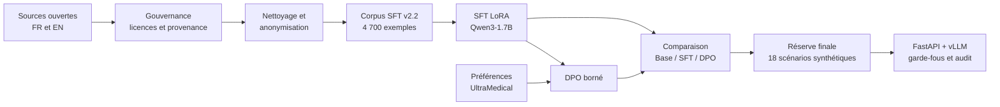
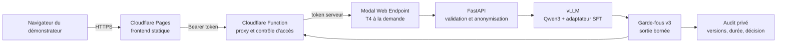
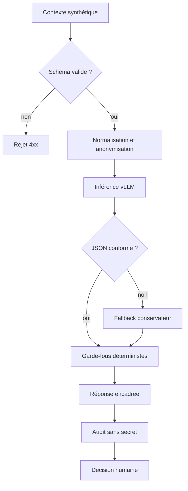

# POC LLM de triage médical

[English](README.md) | **Français**

[](https://github.com/ppluton/medical-triage-llm-poc/actions/workflows/ci.yml)
[](https://www.python.org/)
[](LICENSE)

POC pédagogique bilingue d’un assistant de triage initial, construit avec **Qwen3-1.7B-Base**, un SFT avec LoRA, un essai DPO, une API FastAPI/vLLM et une démonstration cloud protégée.

> [!CAUTION]
> Ce projet n’est ni un dispositif médical, ni un outil de diagnostic ou de prescription. Il utilise uniquement des scénarios synthétiques pour la démonstration. Les niveaux de priorité et les garde-fous restent pédagogiques et n’ont pas été validés par des professionnels de santé.

## Démonstration

**Frontend public : [triage-poc.pierrepluton.com](https://triage-poc.pierrepluton.com/)**

L’accès aux appels d’inférence nécessite un token de démonstration transmis séparément. Après une période d’inactivité, le premier appel peut prendre environ deux minutes : le GPU Modal démarre à la demande puis revient automatiquement à zéro tâche après 120 secondes.

## Ce qui a été construit

| Étape | Résultat vérifié |
|---|---|
| Données | Corpus SFT bilingue v2.2 de 4 700 exemples : 3 721 train, 479 validation, 500 test |
| Confidentialité | 31 occurrences de noms masquées sur 22 lignes ; aucun identifiant direct résiduel au rescan technique |
| SFT | Qwen3-1.7B-Base adapté avec LoRA pendant 150 étapes ; recharge reproductible 30/30 |
| DPO | 20 étapes sur 426 paires train et 54 validation ; poids et référence vérifiés |
| Sélection | Le SFT v39 est retenu : le DPO améliore certaines métriques de forme mais régresse sur un signal qualitatif |
| Test final | Le modèle brut échoue au contrat de triage sur la réserve v46 : 0/18 JSON conforme |
| Sûreté | Schéma contraint, garde-fous déterministes, anonymisation, audit et décision humaine obligatoire |
| Déploiement | Frontend Cloudflare Pages et API GPU Modal/vLLM avec scale-to-zero |
| Vérification | 252 tests CI, Ruff, build Docker et contrôles du conteneur passés sur la PR #4 |

La conclusion importante est volontairement sobre : **le modèle adapté apprend mieux les réponses du corpus, mais le modèle brut ne suffit pas pour produire un triage sûr**. La démonstration repose donc sur un système composé du modèle, d’un contrat de sortie, de garde-fous et d’un audit.

## Parcours du projet



Les jeux `train`, `validation` et `test` restent séparés. La réserve finale a été ouverte une fois après la sélection du modèle et n’a servi à aucun nouveau réglage.

## Architecture déployée



- Cloudflare ne contient ni poids de modèle ni secret côté navigateur.
- Modal conserve le modèle et l’API GPU ; `min_containers=0` évite un GPU permanent.
- Les tokens sont stockés comme secrets fournisseur et ne sont jamais versionnés.
- L’API retourne uniquement `maximum`, `moderate` ou `deferred`, avec avertissement et identifiant d’interaction.

## Chaîne de sûreté



Un HTTP 200 prouve que le chemin technique répond. Il ne prouve ni la pertinence clinique, ni la conformité réglementaire, ni l’intégration dans un système hospitalier.

## Données et entraînements

Les sources, le corpus et les deux méthodes d’adaptation restent documentés séparément afin de ne pas confondre données supervisées et préférences.

### Sources

| Source | Langue | Usage | Licence déclarée |
|---|---|---|---|
| [MedQuAD](https://github.com/abachaa/MedQuAD) | EN | SFT | CC BY 4.0 |
| [MediQAl](https://huggingface.co/datasets/ANR-MALADES/MediQAl) | FR | SFT | CC BY 4.0 |
| [FrenchMedMCQA](https://huggingface.co/datasets/qanastek/frenchmedmcqa) | FR | SFT | Apache 2.0 |
| [UltraMedical-Preference](https://huggingface.co/datasets/TsinghuaC3I/UltraMedical-Preference) | EN | DPO séparé | voir manifeste |

Les données brutes, jeux transformés complets et poids restent hors Git. Le dépôt public conserve leurs schémas, versions, transformations, compteurs et SHA-256.

### Pourquoi SFT, LoRA et DPO ?

- **SFT, Supervised Fine-Tuning** : le modèle apprend à reproduire des réponses de référence à partir d’instructions.
- **LoRA, Low-Rank Adaptation** : seuls de petits adaptateurs sont entraînés, ce qui réduit la mémoire GPU et facilite le versionnement.
- **DPO, Direct Preference Optimization** : le modèle apprend à préférer une réponse choisie à une réponse rejetée, après le SFT.

Le DPO v41 a bien modifié les 392 tenseurs attendus, mais il n’a pas dominé le SFT sur tous les critères. Le POC déploie donc le SFT v39 sélectionné, pas le DPO.

## Résultats mesurés

Les résultats ci-dessous séparent les métriques de développement, la réserve finale gelée et le chemin de service public.

### Comparaison de développement v43

| Mesure | Base | SFT v39 | DPO v41 |
|---|---:|---:|---:|
| NLL moyenne sur 479 validations | 1,532045 | 0,830098 | 0,828884 |
| EOS sur 30 générations | 23 | 24 | 26 |
| Générations au plafond | 7 | 6 | 4 |
| Réponses exactes normalisées | 0 | 5 | 5 |
| Répétition de 4-grammes | 0,2682 | 0,1860 | 0,1420 |

Ces métriques décrivent l’apprentissage et la forme des réponses. Elles ne constituent pas des scores de triage clinique.

### Réserve finale v46

Le SFT retenu produit 0/18 JSON conforme sans décodage contraint, atteint le plafond sur 17/18 sorties et invente plusieurs faits patient. Ce résultat négatif justifie l’architecture avec sortie contrainte et garde-fous.

### Parcours public

Deux appels synthétiques ont été exercés de bout en bout sur le domaine public : douleur thoracique en français et déficit neurologique en anglais. Les deux ont déclenché le niveau `maximum`, un fallback sûr et une trace d’audit rapprochée. Ce contrôle prouve le chemin public sur ces deux cas, pas un benchmark ni une validation clinique.

## CI/CD et reproductibilité

```text
Pull request
  ├── pytest + Ruff + validation JSON
  ├── build Docker
  ├── smoke du conteneur sans modèle
  └── contrôle de la factory authentifiée

Déploiements manuels protégés
  ├── Modal : validation de l’environnement, déploiement, résolution URL, santé
  └── Cloudflare : build Pages, secrets fournisseur, déploiement, santé publique
```

Les workflows de déploiement utilisent `workflow_dispatch` et exigent une confirmation explicite afin d’éviter une dépense GPU ou une publication involontaire.

## Exécution locale

Prérequis : Python 3.13 et Docker pour la validation du conteneur.

```bash
python3 -m venv .venv
.venv/bin/python -m pip install --upgrade pip
.venv/bin/python -m pip install -e '.[dev]'
.venv/bin/python -m pytest
.venv/bin/python -m ruff check src scripts tests deploy
docker build -t medical-triage-llm-poc .
```

Sans fournisseur de modèle configuré, l’API locale retourne volontairement `503` plutôt que d’inventer une réponse.

## Organisation du dépôt

```text
configs/                  configurations versionnées des expériences (voir configs/README.md)
data/manifests/           schémas, provenance, compteurs et checksums
data/samples/             fixtures synthétiques exclusivement
deploy/cloudflare_pages/  frontend et proxy Cloudflare Pages
deploy/modal_app.py       déploiement GPU Modal
docs/decisions/           décisions d’architecture et de gouvernance
docs/archive/             documents de pilotage remplacés
docs/evidence/            résultats observés et limites de preuve (INDEX.md, archive/)
docs/governance/          licences, anonymisation et risques
docs/learning/            notes pédagogiques numérotées (README.md)
docs/technical/           contrats et guides reproductibles
notebooks/                notebook Kaggle de comparaison Base/SFT
reports/                  livrables et support de soutenance
requirements/             dépendances figées pour l’API, Modal et le DPO Kaggle
scripts/                  données, entraînement, évaluation, déploiement et génération du rapport
src/triage_poc/           API, collecte, garde-fous et audit
tests/                    tests automatisés
```

## Parcours conseillé

1. [Index des livrables](reports/LIVRABLES.md)
2. [Rapport technique](reports/RAPPORT_TECHNIQUE_POC.md)
3. [Fiche de soutenance](reports/FICHE_SOUTENANCE.md)
4. [Corpus et gouvernance](docs/technical/CORPUS_ETAPE_1_V1.md)
5. [Sélection Base/SFT/DPO](docs/evidence/COMPARISON_V43_RESULT_2026-09-16.md)
6. [Résultat final de réserve](docs/evidence/SELECTED_RESERVE_V46_RESULT_2026-09-16.md)
7. [Déploiement Modal](docs/evidence/MODAL_DEPLOYMENT_2026-09-16.md)
8. [Déploiement Cloudflare](docs/evidence/CLOUDFLARE_PAGES_DEPLOYMENT_2026-09-16.md)
9. [Index des preuves](docs/evidence/INDEX.md)

## Limites et suite

- Aucune validation clinique indépendante n’a été réalisée.
- Les priorités et seuils sont `proposed_educational_only`.
- Le test public couvre deux scénarios synthétiques, pas une campagne de charge.
- Le cold start GPU reste long pour une démonstration interactive.
- Un pilote réel exigerait gouvernance hospitalière, validation clinique, DPIA, supervision, monitoring et procédure d’arrêt.

## Licence

Le code et la documentation originale sont sous licence [MIT](LICENSE). Chaque dataset et modèle conserve sa licence et ses conditions d’utilisation.
