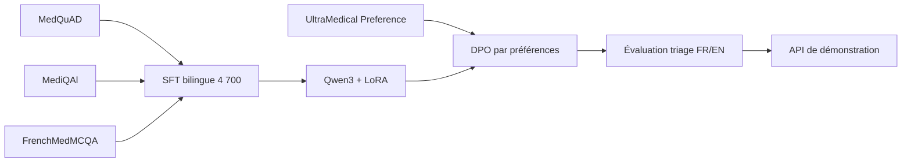

# Medical Triage LLM POC

[English](README.md) | [Français](README.fr.md)

[](https://github.com/ppluton/medical-triage-llm-poc/actions/workflows/ci.yml)
[](https://www.python.org/)
[](LICENSE)

Proof of Concept scolaire d'un assistant IA bilingue de triage médical, réalisé dans le cadre d'un cursus Data Scientist / AI Engineer.

> [!CAUTION]
> Ce projet n'est ni un dispositif médical, ni un outil de diagnostic ou de prescription. Il ne doit pas être utilisé avec de vrais patients. Les sorties et seuils de triage n'ont pas été validés par des professionnels de santé.

## Objectif

Construire une chaîne reproductible allant de corpus médicaux ouverts à un modèle Qwen3 adapté par SFT/LoRA puis DPO, avec une API FastAPI, des garde-fous, des métriques et une traçabilité explicite.



## État vérifié au 16 septembre 2026

| Étape | Résultat disponible |
|---|---|
| Corpus SFT corrigé | 4 700 exemples : 3 721 train / 479 validation / 500 test |
| SFT Qwen3 + LoRA | Checkpoint général à 500 étapes sauvegardé et vérifié |
| DPO | 20 étapes, 426 paires train / 54 validation, poids sauvegardés vérifiés |
| Comparaison finale QA v35 | 500 tests et 50 générations par modèle ; perte Base 1,575 / SFT 0,844 / DPO 0,843 |
| API réelle v34 | 18/18 réponses conformes par adaptateur ; 8/18 priorités conformes aux références proposées |
| Questionnaire et audit | Suivi de collecte FR/EN, anonymisation, synchronisation et redémarrage local testés |
| Validation locale | 171 tests passent ; cela ne vaut pas validation clinique |
| Dernière comparaison API v36 | Lancée, résultats en attente : Base/SFT/DPO et dialogues |
| Déploiement extérieur et PowerPoint | À finaliser ; aucune API publique annoncée |
| Validation clinique | Non réalisée |

Commencer par l'[index des livrables](reports/LIVRABLES.md), le [rapport](reports/RAPPORT_TECHNIQUE_POC.md) et la [feuille de route](docs/technical/ROADMAP_POC_V1.md). Le [résultat final QA](docs/evidence/FINAL_QA_V35_RESULT.md) distingue apprentissage des réponses sources et qualité du triage.

## Sources de données

| Source | Langue | Usage retenu | Licence source |
|---|---|---|---|
| [MedQuAD](https://github.com/abachaa/MedQuAD) | EN | Corpus SFT corrigé | CC BY 4.0 |
| [MediQAl](https://huggingface.co/datasets/ANR-MALADES/MediQAl) | FR | Corpus SFT corrigé | CC BY 4.0 |
| [FrenchMedMCQA](https://huggingface.co/datasets/qanastek/frenchmedmcqa) | FR | Corpus SFT corrigé | Apache 2.0 |
| [UltraMedical-Preference](https://huggingface.co/datasets/TsinghuaC3I/UltraMedical-Preference) | EN | DPO, étape séparée | voir manifeste |

Les données brutes, datasets générés et poids de modèle ne sont pas versionnés. Le dépôt conserve les schémas, configurations, versions de sources, transformations, compteurs et SHA-256 nécessaires à la reproductibilité. Les licences des sources restent applicables à leurs contenus respectifs ; la licence MIT de ce dépôt couvre uniquement le code et la documentation originale.

## Installation

Prérequis : Python 3.13.

```bash
python3 -m venv .venv
.venv/bin/python -m pip install --upgrade pip
.venv/bin/python -m pip install -e '.[dev]'
.venv/bin/python -m spacy download fr_core_news_md
.venv/bin/python -m spacy download en_core_web_sm
```

## Vérification locale

```bash
.venv/bin/python -m pytest
.venv/bin/python -m ruff check src scripts tests
docker build -t medical-triage-llm-poc .
```

Lancer l'API de démonstration :

```bash
.venv/bin/uvicorn triage_poc.api:app --reload
curl -X POST http://127.0.0.1:8000/v1/triage \
  -H 'Content-Type: application/json' \
  -d '{"language":"fr","patient_context":{"age_group":"adult","symptoms":["scénario synthétique"]}}'
```

Sans fournisseur de modèle configuré, cette commande retourne volontairement `503`. Le contrat de l'API est documenté dans [API_POC_V1.md](docs/technical/API_POC_V1.md).

## Organisation

```text
configs/          configurations reproductibles des expériences
data/manifests/   schémas, versions de sources, compteurs et checksums
data/samples/     petits fixtures exclusivement synthétiques
docs/decisions/   décisions d'architecture et de gouvernance
docs/evidence/    résultats observés et limites des preuves
docs/governance/  licences, provenance, anonymisation et risques
docs/learning/    explications pédagogiques des étapes
docs/technical/   pipeline, contrats et guides reproductibles
scripts/          audits, préparation des données et runners
src/triage_poc/   bibliothèque et API du POC
tests/            tests automatisés
```

## Résultats et limites

Le SFT réduit la perte sur les 500 exemples réservés. Le DPO apporte un écart faible sur cette mesure ; aucun gain clinique n'est démontré. Dans la dernière API mesurée (v34), les six scénarios critiques proposés sont classés `maximum`, mais le niveau `moderate` est absent et les questions complémentaires restent insuffisantes. La version locale suivante ajoute un suivi explicite des rubriques ; sa vérification GPU v36 reste en cours. Voir les [résultats API](docs/evidence/VLLM_API_V34_RESULT.md) et les [résultats finaux QA](docs/evidence/FINAL_QA_V35_RESULT.md).

## Documentation de référence

- [Cadrage de mission](CADRAGE_MISSION.md)
- [Spécification fonctionnelle et technique](SPEC_POC_TRIAGE_MEDICAL.md)
- [Manifeste du corpus corrigé](data/manifests/derived-source-medical-qa-sft-v2.1-reviewed.json)
- [Historique : premier corpus de 5 000 paires](docs/evidence/GENERATION_SFT_SOURCE_5000_2026-09-04.md)
- [Règles de contribution](CONTRIBUTING.md)
- [Politique de sécurité](SECURITY.md)

## Licence

Code et documentation originale sous licence [MIT](LICENSE). Les datasets et modèles conservent leurs propres licences et conditions d'utilisation.
