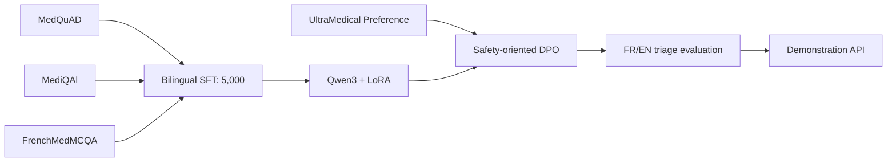

# Medical Triage LLM POC

[English](README.md) | [Français](README.fr.md)

[](https://github.com/ppluton/medical-triage-llm-poc/actions/workflows/ci.yml)
[](https://www.python.org/)
[](LICENSE)

An educational Proof of Concept for a bilingual AI-assisted medical triage system, developed as part of a Data Scientist / AI Engineer curriculum.

> [!CAUTION]
> This project is not a medical device, diagnostic tool, or prescription system. It must not be used with real patients. Its outputs and triage thresholds have not been validated by healthcare professionals.

## Objective

Build a reproducible pipeline from open medical corpora to a Qwen3 model adapted through SFT/LoRA and then DPO, with a FastAPI interface, safety guardrails, metrics, and explicit traceability.



## Current status

| Milestone | Status |
|---|---|
| Audit, licenses, and versions of the four sources | completed |
| Source-derived SFT dataset | 5,000 pairs: 2,500 FR / 2,500 EN |
| SFT splits | 4,000 train / 500 validation / 500 test |
| Qwen3 tokenizer preflight | passed, no sequence above 2,048 tokens |
| LoRA micro-run | 20 steps completed on Apple MLX |
| Full SFT training | not started |
| DPO dataset and training | not started |
| Clinical validation | not performed |

The [roadmap](docs/technical/ROADMAP_POC_V1.md) systematically distinguishes implemented code, technical evidence, and clinical validation.

## Data sources

| Source | Language | Intended use | Source license |
|---|---|---|---|
| [MedQuAD](https://github.com/abachaa/MedQuAD) | EN | 2,500 SFT pairs | CC BY 4.0 |
| [MediQAl](https://huggingface.co/datasets/ANR-MALADES/MediQAl) | FR | 1,500 SFT pairs | CC BY 4.0 |
| [FrenchMedMCQA](https://huggingface.co/datasets/qanastek/frenchmedmcqa) | FR | 1,000 SFT pairs | Apache 2.0 |
| [UltraMedical-Preference](https://huggingface.co/datasets/TsinghuaC3I/UltraMedical-Preference) | EN | separate DPO stage | see source manifest |

Raw data, generated datasets, and model weights are not committed. The repository retains the schemas, configurations, source versions, transformation records, counters, and SHA-256 hashes required for reproducibility. Each source dataset remains governed by its own license; this repository's MIT license applies only to the original code and documentation.

## Installation

Prerequisite: Python 3.13.

```bash
python3 -m venv .venv
.venv/bin/python -m pip install --upgrade pip
.venv/bin/python -m pip install -e '.[dev]'
.venv/bin/python -m spacy download fr_core_news_md
.venv/bin/python -m spacy download en_core_web_sm
```

## Local verification

```bash
.venv/bin/python -m pytest
.venv/bin/python -m ruff check src scripts tests
docker build -t medical-triage-llm-poc .
```

Run the demonstration API:

```bash
.venv/bin/uvicorn triage_poc.api:app --reload
curl -X POST http://127.0.0.1:8000/v1/triage \
  -H 'Content-Type: application/json' \
  -d '{"language":"en","patient_context":{"age_group":"adult","symptoms":["synthetic scenario"]}}'
```

Without a configured model provider, this request intentionally returns `503`. The API contract is documented in [API_POC_V1.md](docs/technical/API_POC_V1.md).

## Repository structure

```text
configs/          reproducible experiment configurations
data/manifests/   schemas, source versions, counters, and checksums
data/samples/     small, exclusively synthetic fixtures
docs/decisions/   architecture and governance decisions
docs/evidence/    observed results and evidence limitations
docs/governance/  licenses, provenance, anonymization, and risks
docs/learning/    educational explanations for each stage
docs/technical/   pipeline, contracts, and reproducible guides
scripts/          audit, data-preparation, and experiment runners
src/triage_poc/   POC library and API
tests/            automated tests
```

## Results and limitations

The micro-run demonstrates that Qwen3-1.7B Base can load the source-derived dataset, complete 20 LoRA steps on MLX, and save an adapter. It does not demonstrate convergence, improved triage performance, or clinical safety. Metrics and evidence limitations are recorded in [SFT_SOURCE_MICRO_RUN_2026-09-04.md](docs/evidence/SFT_SOURCE_MICRO_RUN_2026-09-04.md).

## Reference documentation

- [Project brief](CADRAGE_MISSION.md) — French
- [Functional and technical specification](SPEC_POC_TRIAGE_MEDICAL.md) — French
- [SFT dataset documentation](docs/technical/DATASET_SFT_SOURCE_5000_V1.md) — French
- [Evidence for the 5,000-pair generation](docs/evidence/GENERATION_SFT_SOURCE_5000_2026-09-04.md) — French
- [Contribution guidelines](CONTRIBUTING.md) — French
- [Security policy](SECURITY.md) — French

## License

Original code and documentation are available under the [MIT License](LICENSE). Datasets and models retain their respective licenses and terms of use.
