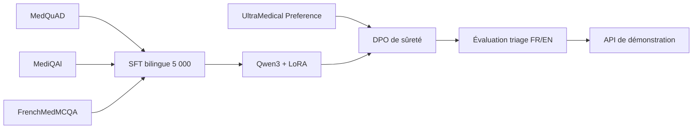

# Medical Triage LLM POC

[](https://github.com/ppluton/medical-triage-llm-poc/actions/workflows/ci.yml)
[](https://www.python.org/)
[](LICENSE)

Proof of Concept scolaire d'un assistant IA bilingue de triage médical, réalisé dans le cadre d'un cursus Data Scientist / AI Engineer.

> [!CAUTION]
> Ce projet n'est ni un dispositif médical, ni un outil de diagnostic ou de prescription. Il ne doit pas être utilisé avec de vrais patients. Les sorties et seuils de triage n'ont pas été validés par des professionnels de santé.

## Objectif

Construire une chaîne reproductible allant de corpus médicaux ouverts à un modèle Qwen3 adapté par SFT/LoRA puis DPO, avec une API FastAPI, des garde-fous, des métriques et une traçabilité explicite.



## État réel

| Jalon | État |
|---|---|
| Audit, licences et versions des quatre sources | réalisé |
| Dataset SFT source-derived | 5 000 paires, 2 500 FR / 2 500 EN |
| Splits SFT | 4 000 train / 500 validation / 500 test |
| Pré-vol tokenizer Qwen3 | réussi, aucune séquence au-dessus de 2 048 tokens |
| Micro-run LoRA | 20 étapes terminées sur Apple MLX |
| Entraînement SFT complet | non démarré |
| Dataset et entraînement DPO | non démarrés |
| Validation clinique | non réalisée |

La [roadmap](docs/technical/ROADMAP_POC_V1.md) distingue systématiquement code présent, preuve technique et validation clinique.

## Sources de données

| Source | Langue | Usage retenu | Licence source |
|---|---|---|---|
| [MedQuAD](https://github.com/abachaa/MedQuAD) | EN | 2 500 paires SFT | CC BY 4.0 |
| [MediQAl](https://huggingface.co/datasets/ANR-MALADES/MediQAl) | FR | 1 500 paires SFT | CC BY 4.0 |
| [FrenchMedMCQA](https://huggingface.co/datasets/qanastek/frenchmedmcqa) | FR | 1 000 paires SFT | Apache 2.0 |
| [UltraMedical-Preference](https://huggingface.co/datasets/TsinghuaC3I/UltraMedical-Preference) | EN | DPO, étape séparée | voir manifeste |

Les données brutes, datasets générés et poids de modèle ne sont pas versionnés. Le dépôt conserve les schémas, configurations, versions de sources, transformations, compteurs et SHA-256 nécessaires à la reproductibilité. Les licences des sources restent applicables à leurs contenus respectifs ; la licence MIT de ce dépôt couvre uniquement le code et la documentation originale.

## Installation

Prérequis : Python 3.13.

```bash
python3 -m venv .venv
.venv/bin/python -m pip install --upgrade pip
.venv/bin/python -m pip install -e '.[dev]'
.venv/bin/python -m spacy download fr_core_news_md
.venv/bin/python -m spacy download en_core_web_sm
```

## Vérification locale

```bash
.venv/bin/python -m pytest
.venv/bin/python -m ruff check src scripts tests
docker build -t medical-triage-llm-poc .
```

Lancer l'API de démonstration :

```bash
.venv/bin/uvicorn triage_poc.api:app --reload
curl -X POST http://127.0.0.1:8000/v1/triage \
  -H 'Content-Type: application/json' \
  -d '{"language":"fr","patient_context":{"age_group":"adult","symptoms":["scénario synthétique"]}}'
```

Sans fournisseur de modèle configuré, cette commande retourne volontairement `503`. Le contrat de l'API est documenté dans [API_POC_V1.md](docs/technical/API_POC_V1.md).

## Organisation

```text
configs/          configurations reproductibles des expériences
data/manifests/   schémas, versions de sources, compteurs et checksums
data/samples/     petits fixtures exclusivement synthétiques
docs/decisions/   décisions d'architecture et de gouvernance
docs/evidence/    résultats observés et limites des preuves
docs/governance/  licences, provenance, anonymisation et risques
docs/learning/    explications pédagogiques des étapes
docs/technical/   pipeline, contrats et guides reproductibles
scripts/          audits, préparation des données et runners
src/triage_poc/   bibliothèque et API du POC
tests/            tests automatisés
```

## Résultats et limites

Le micro-run prouve que Qwen3-1.7B Base peut charger le dataset source-derived, exécuter 20 étapes LoRA sur MLX et sauvegarder un adaptateur. Il ne prouve ni convergence, ni amélioration du triage, ni sûreté clinique. Les métriques et limites sont consignées dans [SFT_SOURCE_MICRO_RUN_2026-09-04.md](docs/evidence/SFT_SOURCE_MICRO_RUN_2026-09-04.md).

## Documentation de référence

- [Cadrage de mission](CADRAGE_MISSION.md)
- [Spécification fonctionnelle et technique](SPEC_POC_TRIAGE_MEDICAL.md)
- [Documentation du dataset SFT](docs/technical/DATASET_SFT_SOURCE_5000_V1.md)
- [Preuve de génération des 5 000 paires](docs/evidence/GENERATION_SFT_SOURCE_5000_2026-09-04.md)
- [Règles de contribution](CONTRIBUTING.md)
- [Politique de sécurité](SECURITY.md)

## Licence

Code et documentation originale sous licence [MIT](LICENSE). Les datasets et modèles conservent leurs propres licences et conditions d'utilisation.
