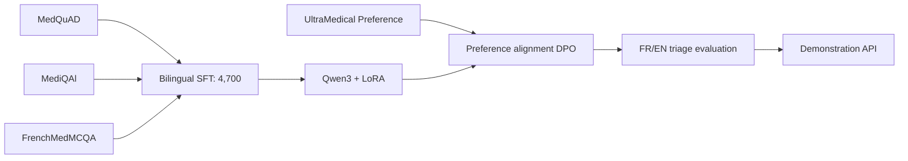

# Medical Triage LLM POC

[English](README.md) | [Français](README.fr.md)

[](https://github.com/ppluton/medical-triage-llm-poc/actions/workflows/ci.yml)
[](https://www.python.org/)
[](LICENSE)

An educational Proof of Concept for a bilingual AI-assisted medical triage system, developed as part of a Data Scientist / AI Engineer curriculum.

> [!CAUTION]
> This project is not a medical device, diagnostic tool, or prescription system. It must not be used with real patients. Its outputs and triage thresholds have not been validated by healthcare professionals.

## Restart guide

[Spécification d’exécution — stack, contrat et livraison](SPEC_EXECUTION_V1.md)

The project is undergoing a methodical restart. Follow the [active guide (French)](GUIDE_REPRISE.md) and [lessons learned](docs/learning/RETOUR_EXPERIENCE_REPRISE_2026-09-16.md). Results below describe the first implementation; they do not automatically validate the restarted workflow.

## Objective

Build a reproducible pipeline from open medical corpora to a Qwen3 model adapted through SFT/LoRA and then DPO, with a FastAPI interface, safety guardrails, metrics, and explicit traceability.



## Verified status — 16 September 2026

| Stage | Available evidence |
|---|---|
| Corrected SFT corpus | 4,700 examples: 3,721 train / 479 validation / 500 test |
| Qwen3 SFT + LoRA | General checkpoint at 500 steps saved and verified |
| DPO | 20 steps, 426 training pairs / 54 validation pairs, saved weights verified |
| Final QA comparison v35 | 500 test examples and 50 generations per model; loss Base 1.575 / SFT 0.844 / DPO 0.843 |
| Real API v34 | 18/18 schema-valid responses per adapter; 8/18 priorities match proposed references |
| Questionnaire and audit | Bilingual collection, anonymization, file synchronization and local restart tested |
| Local verification | 171 tests pass; this is not clinical validation |
| Latest API comparison v36 | Launched, results pending: Base/SFT/DPO and dialogues |
| External deployment and slide deck | Still to complete; no public API announced |
| Clinical validation | Not performed |

Start with the [deliverables index](reports/LIVRABLES.md), [report](reports/RAPPORT_TECHNIQUE_POC.md), and [roadmap](docs/technical/ROADMAP_POC_V1.md). The [final QA evidence](docs/evidence/FINAL_QA_V35_RESULT.md) separates learning source answers from triage quality.

## Data sources

| Source | Language | Intended use | Source license |
|---|---|---|---|
| [MedQuAD](https://github.com/abachaa/MedQuAD) | EN | Corrected SFT corpus | CC BY 4.0 |
| [MediQAl](https://huggingface.co/datasets/ANR-MALADES/MediQAl) | FR | Corrected SFT corpus | CC BY 4.0 |
| [FrenchMedMCQA](https://huggingface.co/datasets/qanastek/frenchmedmcqa) | FR | Corrected SFT corpus | Apache 2.0 |
| [UltraMedical-Preference](https://huggingface.co/datasets/TsinghuaC3I/UltraMedical-Preference) | EN | separate DPO stage | see source manifest |

Raw data, generated datasets, and model weights are not committed. The repository retains the schemas, configurations, source versions, transformation records, counters, and SHA-256 hashes required for reproducibility. Each source dataset remains governed by its own license; this repository's MIT license applies only to the original code and documentation.

## Installation

Prerequisite: Python 3.13.

```bash
python3 -m venv .venv
.venv/bin/python -m pip install --upgrade pip
.venv/bin/python -m pip install -e '.[dev]'
.venv/bin/python -m spacy download fr_core_news_md
.venv/bin/python -m spacy download en_core_web_sm
```

## Local verification

```bash
.venv/bin/python -m pytest
.venv/bin/python -m ruff check src scripts tests
docker build -t medical-triage-llm-poc .
```

Run the demonstration API:

```bash
.venv/bin/uvicorn triage_poc.api:app --reload
curl -X POST http://127.0.0.1:8000/v1/triage \
  -H 'Content-Type: application/json' \
  -d '{"language":"en","patient_context":{"age_group":"adult","symptoms":["synthetic scenario"]}}'
```

Without a configured model provider, this request intentionally returns `503`. The API contract is documented in [API_POC_V1.md](docs/technical/API_POC_V1.md).

## Repository structure

```text
configs/          reproducible experiment configurations
data/manifests/   schemas, source versions, counters, and checksums
data/samples/     small, exclusively synthetic fixtures
docs/decisions/   architecture and governance decisions
docs/evidence/    observed results and evidence limitations
docs/governance/  licenses, provenance, anonymization, and risks
docs/learning/    educational explanations for each stage
docs/technical/   pipeline, contracts, and reproducible guides
scripts/          audit, data-preparation, and experiment runners
src/triage_poc/   POC library and API
tests/            automated tests
```

## Results and limitations

SFT reduces response loss on the 500 held-out examples. DPO changes this metric only slightly; no clinical benefit is established. In the latest measured API run (v34), all six proposed critical scenarios receive `maximum`, but `moderate` is never used and follow-up questions remain insufficient. The next local version adds explicit field tracking; its GPU verification v36 is running. See [API results](docs/evidence/VLLM_API_V34_RESULT.md) and [final QA results](docs/evidence/FINAL_QA_V35_RESULT.md).

## Reference documentation

- [Project brief](CADRAGE_MISSION.md) — French
- [Functional and technical specification](SPEC_POC_TRIAGE_MEDICAL.md) — French
- [Corrected corpus manifest](data/manifests/derived-source-medical-qa-sft-v2.1-reviewed.json) — French
- [Historical first 5,000-pair corpus](docs/evidence/GENERATION_SFT_SOURCE_5000_2026-09-04.md) — French
- [Contribution guidelines](CONTRIBUTING.md) — French
- [Security policy](SECURITY.md) — French

## License

Original code and documentation are available under the [MIT License](LICENSE). Datasets and models retain their respective licenses and terms of use.
