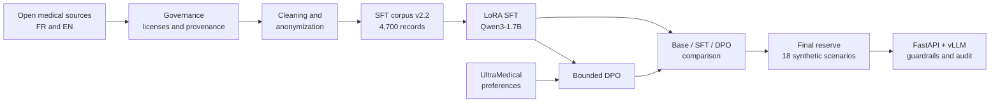
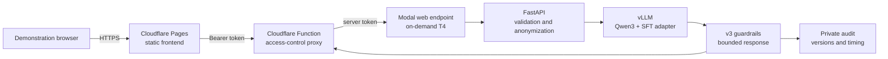
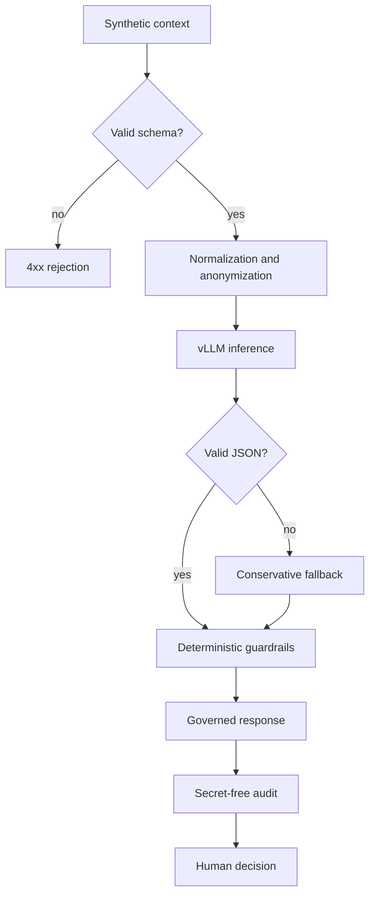

# Medical Triage LLM POC

**English** | [Français](README.fr.md)

[](https://github.com/ppluton/medical-triage-llm-poc/actions/workflows/ci.yml)
[](https://www.python.org/)
[](LICENSE)

An educational bilingual initial-triage assistant built with **Qwen3-1.7B-Base**, LoRA supervised fine-tuning, an experimental DPO stage, a FastAPI/vLLM backend, and a protected cloud demonstration.

> [!CAUTION]
> This project is not a medical device, diagnostic tool, or prescription system. The demonstration uses synthetic scenarios only. Its triage levels and guardrails are educational proposals and have not been validated by healthcare professionals.

## Demonstration

**Public frontend: [triage-poc.pierrepluton.com](https://triage-poc.pierrepluton.com/)**

Inference calls require a demonstration token shared separately. After an idle period, the first request may take about two minutes while Modal starts the GPU. The service then scales back to zero active tasks after 120 seconds.

## Verified project status

| Stage | Verified result |
|---|---|
| Data | Bilingual SFT corpus v2.2 with 4,700 records: 3,721 train, 479 validation, 500 test |
| Privacy controls | 31 name occurrences masked across 22 records; no residual direct identifier in the technical rescan |
| SFT | Qwen3-1.7B-Base adapted with LoRA for 150 steps; reproducible 30/30 reload |
| DPO | 20 steps on 426 training and 54 validation preference pairs; policy and reference weights verified |
| Selection | SFT v39 selected because DPO improved form metrics but regressed on one qualitative signal |
| Final reserve | Raw model failed the v46 triage contract: 0/18 valid JSON outputs |
| Safety | Constrained schema, deterministic guardrails, anonymization, audit, and mandatory human decision |
| Deployment | Cloudflare Pages frontend and Modal/vLLM GPU API with scale-to-zero |
| CI | 252 tests, Ruff, Docker build, and container checks passed on PR #4 |

The key result is deliberately cautious: **fine-tuning improved corpus-answer modeling, but the raw model is not sufficient for safe triage output**. The demonstration therefore combines the model with a response contract, deterministic guardrails, and an audit trail.

## Project pipeline



Training, validation, test, and final-reserve data remain isolated. The final reserve was opened once after model selection and was not used for further tuning.

## Deployed architecture



- Cloudflare holds no model weights and exposes no server secret to the browser.
- Modal hosts the GPU model and API; `min_containers=0` prevents permanent GPU usage.
- Provider secrets are never committed to Git.
- The API only returns `maximum`, `moderate`, or `deferred`, plus a warning and interaction ID.

## Safety path



An HTTP 200 proves that the technical path responded. It does not prove clinical relevance, regulatory compliance, or hospital integration.

## Data and training

| Source | Language | Use | Declared license |
|---|---|---|---|
| [MedQuAD](https://github.com/abachaa/MedQuAD) | EN | SFT | CC BY 4.0 |
| [MediQAl](https://huggingface.co/datasets/ANR-MALADES/MediQAl) | FR | SFT | CC BY 4.0 |
| [FrenchMedMCQA](https://huggingface.co/datasets/qanastek/frenchmedmcqa) | FR | SFT | Apache 2.0 |
| [UltraMedical-Preference](https://huggingface.co/datasets/TsinghuaC3I/UltraMedical-Preference) | EN | separate DPO stage | see manifest |

Raw data, complete transformed datasets, and model weights remain outside Git. Public manifests retain schemas, versions, transformations, counts, and SHA-256 identifiers.

- **SFT, Supervised Fine-Tuning:** learns reference responses from instructions.
- **LoRA, Low-Rank Adaptation:** trains small adapters instead of all model parameters.
- **DPO, Direct Preference Optimization:** learns to prefer chosen responses over rejected responses after SFT.

DPO v41 modified all 392 expected policy tensors, but it did not dominate SFT across the selection criteria. The deployed candidate is therefore SFT v39, not DPO.

## Measured results

The results below separate development metrics, the frozen final reserve, and the public serving path.

### v43 development comparison

| Metric | Base | SFT v39 | DPO v41 |
|---|---:|---:|---:|
| Mean NLL on 479 validation records | 1.532045 | 0.830098 | 0.828884 |
| EOS over 30 generations | 23 | 24 | 26 |
| Generations reaching the token limit | 7 | 6 | 4 |
| Normalized exact answers | 0 | 5 | 5 |
| Repeated 4-gram fraction | 0.2682 | 0.1860 | 0.1420 |

These measurements describe learning and response form. They are not clinical triage scores.

### v46 final reserve

Without constrained decoding, the selected SFT produced 0/18 valid JSON responses, reached the token limit in 17/18 cases, and invented patient facts. This negative result supports the layered serving architecture.

### Public path

Two synthetic scenarios were exercised end to end on the public domain: chest pain in French and a neurological deficit in English. Both triggered `maximum`, a safe fallback, and a reconciled audit record. This proves the public path for those two cases, not load performance or clinical validity.

## CI/CD and reproducibility

```text
Pull request
  ├── pytest + Ruff + JSON validation
  ├── Docker build
  ├── model-free container smoke test
  └── authenticated serving-factory check

Protected manual deployments
  ├── Modal: environment validation, deploy, URL resolution, health check
  └── Cloudflare: Pages build, provider secrets, deploy, public health check
```

Deployment workflows use `workflow_dispatch` and require explicit confirmation to avoid unintended publication or GPU spending.

## Local verification

Prerequisites: Python 3.13 and Docker for container validation.

```bash
python3 -m venv .venv
.venv/bin/python -m pip install --upgrade pip
.venv/bin/python -m pip install -e '.[dev]'
.venv/bin/python -m pytest
.venv/bin/python -m ruff check src scripts tests deploy
docker build -t medical-triage-llm-poc .
```

Without a configured model provider, the local API deliberately returns `503` instead of fabricating a response.

## Repository map

```text
configs/                  versioned experiment configurations (see configs/README.md)
data/manifests/           schemas, provenance, counts, and checksums
data/samples/             synthetic fixtures only
deploy/cloudflare_pages/  Cloudflare frontend and proxy
deploy/modal_app.py       Modal GPU deployment
docs/decisions/           architecture and governance decisions
docs/archive/             superseded planning documents
docs/evidence/            observed results and evidence limits (INDEX.md, archive/)
docs/governance/          licenses, anonymization, and risks
docs/learning/            numbered educational notes (README.md)
docs/technical/           contracts and reproducible guides
notebooks/                Kaggle Base/SFT comparison notebook
reports/                  deliverables and defense material
requirements/             pinned dependencies for API, Modal, and Kaggle DPO
scripts/                  data, training, evaluation, deployment, and report builders
src/triage_poc/           API, collection, guardrails, and audit
tests/                    automated tests
```

## Suggested reading path

1. [Deliverables index](reports/LIVRABLES.md)
2. [Technical report](reports/RAPPORT_TECHNIQUE_POC.md)
3. [Defense cheat sheet, French](reports/FICHE_SOUTENANCE.md)
4. [Corpus and governance](docs/technical/CORPUS_ETAPE_1_V1.md)
5. [Base/SFT/DPO selection](docs/evidence/COMPARISON_V43_RESULT_2026-09-16.md)
6. [Final reserve result](docs/evidence/SELECTED_RESERVE_V46_RESULT_2026-09-16.md)
7. [Modal deployment](docs/evidence/MODAL_DEPLOYMENT_2026-09-16.md)
8. [Cloudflare deployment](docs/evidence/CLOUDFLARE_PAGES_DEPLOYMENT_2026-09-16.md)
9. [Evidence index, French](docs/evidence/INDEX.md)

## Limitations and next steps

- No independent clinical validation has been performed.
- Priority rules and thresholds remain `proposed_educational_only`.
- Public verification covers two synthetic cases, not a load campaign.
- GPU cold starts remain long for an interactive demonstration.
- A real pilot would require hospital governance, clinical validation, a DPIA, monitoring, and shutdown procedures.

## License

Original code and documentation are available under the [MIT License](LICENSE). Each dataset and model retains its own license and terms of use.
