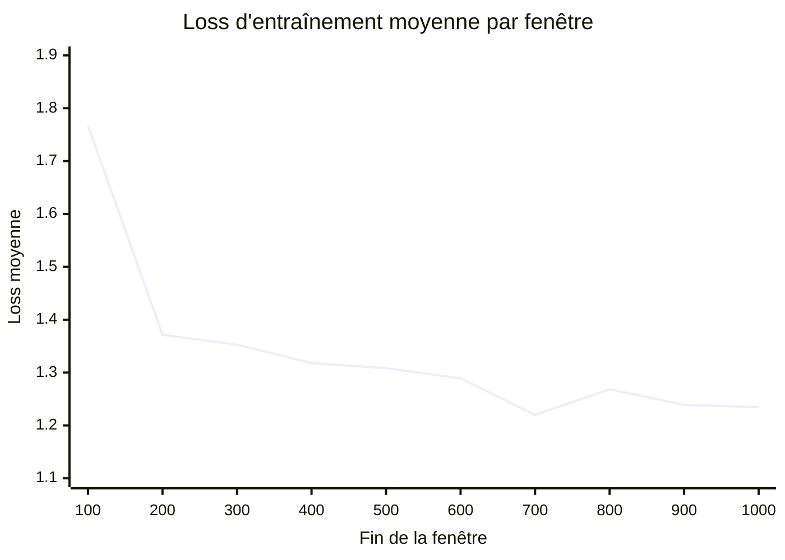
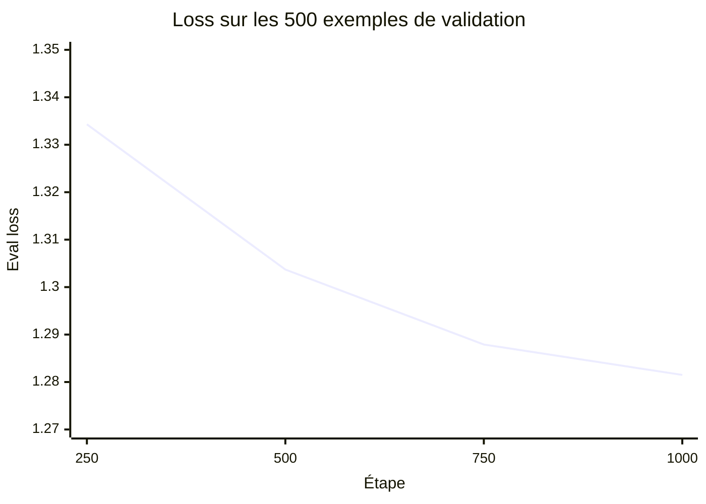
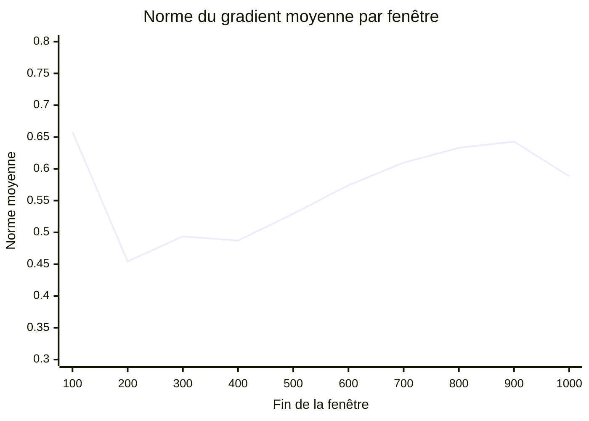

# Résultat final du SFT complet sur Kaggle — version 5

- **Date :** 2026-09-04
- **Statut :** `verified` — exécution terminée et archive locale contrôlée
- **Environnement :** notebook Kaggle privé, GPU NVIDIA Tesla T4, Unsloth `2026.8.22`
- **Modèle :** `unsloth/Qwen3-1.7B-Base` à la révision `e249956c10337100486d07afb77e3eb2b30906b8`
- **Sources :** `CADRAGE_MISSION.md`, `SPEC_POC_TRIAGE_MEDICAL.md`, version Kaggle `347238567`, `run_summary.json`, `run_plan.json`, `trainer_state.json`, `configs/source_sft_lora_kaggle.yaml`, configuration LoRA et archive téléchargée

## Question vérifiée

Le SFT complet a-t-il réellement terminé et produit les adaptateurs, checkpoints, métriques et métadonnées nécessaires pour poursuivre le POC sans utiliser le split `test` ?

## Conclusion

**Oui, pour l'exécution technique et la conservation des artefacts.** Le run a atteint les 1 000 étapes prévues sur deux epochs, a évalué quatre fois les 500 exemples de validation, a sauvegardé deux checkpoints et un adaptateur final, puis a publié une archive ZIP intègre. Le split `test` n'a pas été utilisé.

**La comparaison Base versus SFT reste obligatoire.** Cette preuve ne montre pas encore que l'adaptateur améliore les réponses, le triage ou la sûreté. Elle ne constitue pas une validation clinique.

## Périmètre du run

| Élément | Valeur observée |
|---|---:|
| Exemples d'entraînement | 4 000 |
| Exemples de validation | 500 |
| Exemples de test utilisés | 0 |
| Epochs | 2 |
| Étapes | 1 000 / 1 000 |
| Batch effectif | 8 |
| Longueur maximale | 2 048 tokens |
| Learning rate initial | `1e-4` |
| Précision | FP16, modèle chargé en 4 bits |
| LoRA | rang 16, alpha 16, dropout 0 |
| Modules ciblés | projections attention et MLP |
| Seed / data seed | 42 / 42 |
| SHA-256 du dataset SFT préparé | `da7b7913cc70a4cd1c340d8afb1bfcc910af5eb7b8511f81b18f356d8420b347` |

Versions enregistrées dans le résumé du run : PyTorch `2.10.0+cu128`, Transformers `5.5.0`, TRL `0.23.1`, PEFT `0.18.1`, Accelerate `1.14.0`, bitsandbytes `0.50.2`, Datasets `4.3.0`, Unsloth `2026.8.22` et Unsloth Zoo `2026.8.16`.

Le temps d'entraînement journalisé est de **12 463,7 secondes**, soit environ **3 h 27 min 44 s**. Le temps total affiché par Kaggle, incluant installation, chargement, validations et sauvegardes, est d'environ **3 h 41 min**.

## Intégrité des sorties téléchargées

Archive locale contrôlée : `source-sft-cuda-full.zip`. Elle reste hors Git conformément aux règles du dépôt.

| Contrôle | Résultat |
|---|---|
| Taille téléchargée | 435 Mio, environ 456 Mo décimaux |
| Contenu non compressé | 523 334 491 octets |
| Nombre d'entrées | 37 fichiers et dossiers |
| Test ZIP | aucune erreur détectée |
| SHA-256 du ZIP | `aa5945ca9be2463f6294d4f6fc07d34a53f7ef4c886a6a3c2931e66d841122cd` |
| Checkpoints conservés | `checkpoint-750`, `checkpoint-1000` |
| Adaptateur retenu | `best-adapter` |
| Taille d'un adaptateur LoRA | 69 782 384 octets |
| SHA-256 de `best-adapter` | `3f050ae77a4b66ecf4a254a407a463a046143437198ac5dfbd7922b75b28a940` |
| SHA-256 de l'adaptateur étape 1 000 | identique à `best-adapter` |

L'identité des deux checksums confirme que le meilleur modèle sélectionné par `eval_loss` est bien le checkpoint final de l'étape 1 000.

## Métriques finales

| Mesure | Valeur observée |
|---|---:|
| `train_loss` global rapporté | 1,3369 |
| Première loss brute, étape 10 | 2,7910 |
| Dernière loss brute, étape 1 000 | 1,2945 |
| Loss moyenne, étapes 10–100 | 1,7673 |
| Loss moyenne, étapes 910–1 000 | 1,2346 |
| Meilleure `eval_loss` | 1,2815 à l'étape 1 000 |
| Norme du gradient minimale | 0,3241 |
| Norme du gradient moyenne | 0,5670 |
| Norme du gradient maximale | 1,2366 |

La loss d'entraînement moyenne par fenêtres de 100 étapes diminue de **30,1 %** entre la première et la dernière fenêtre. La loss de validation diminue de **4,0 %** entre les étapes 250 et 1 000. Les quatre validations s'améliorent successivement ; aucune remontée de la loss de validation n'est observée dans ces quatre points.

## Courbe de loss d'entraînement

Chaque point représente la moyenne des dix mesures enregistrées dans une fenêtre de 100 étapes. Cette agrégation rend la tendance plus lisible que les mini-batches bruts.

La baisse est très forte au début, puis devient plus lente. Les remontées locales restent compatibles avec la variabilité des mini-batches ; elles ne forment pas une divergence durable.

## Courbe de validation

| Étape | Epoch | `eval_loss` |
|---:|---:|---:|
| 250 | 0,5 | 1,3343 |
| 500 | 1,0 | 1,3037 |
| 750 | 1,5 | 1,2879 |
| 1 000 | 2,0 | **1,2815** |

La validation s'améliore de façon monotone sur les quatre mesures. Cela ne permet pas de conclure que deux epochs sont optimales : il faudrait tester d'autres configurations sur le split de validation pour l'établir, sans toucher au test.

## Stabilité de la norme du gradient

Les 100 mesures de `grad_norm` restent finies, entre 0,324 et 1,237, sans explosion visible. Cela soutient une conclusion de stabilité numérique du run, pas une conclusion médicale.

## Correspondance avec le brief de mission

| Exigence | Niveau de preuve | Justification |
|---|---|---|
| SFT/LoRA complet exécuté | **Prouvé** | statut final, 1 000 étapes, 2 epochs et résumé du run |
| Hyperparamètres et versions conservés | **Prouvé** | plan, résumé, configuration LoRA et versions des packages |
| Logs et métriques intermédiaires | **Prouvé** | 100 points train, 4 validations et normes de gradient |
| Checkpoints et adaptateur sauvegardés | **Prouvé** | archive intègre, checkpoints 750/1 000 et `best-adapter` |
| Split test isolé | **Prouvé pour ce run** | `test_records_used = 0` et bundle train/validation |
| Rechargement et inférence locale de l'adaptateur | **Non encore prouvé** | prochain contrôle reproductible à effectuer |
| Amélioration par rapport au modèle Base | **Non prouvé** | comparaison identique Base versus SFT non encore exécutée |
| Qualité ou sûreté du triage | **Non prouvé** | le dataset SFT ne contient pas de labels de triage validés |
| Validation clinique | **Non réalisée** | aucune revue clinique de ce résultat n'est revendiquée |

## Anomalie documentaire mineure

`run_plan.json` conserve le statut préparatoire `cuda_training_pending`, tandis que `run_summary.json`, `trainer_state.json`, les checkpoints et le statut Kaggle prouvent l'achèvement. Cette incohérence n'affecte pas les poids, mais le générateur du plan devra être corrigé pour qu'un prochain run mette à jour ce statut ou utilise un champ immuable décrivant seulement l'intention initiale.

## Décision et prochaine étape

Le SFT complet est **accepté comme terminé techniquement**. Il ne doit pas être relancé avant la comparaison.

La prochaine étape est de vérifier le chargement de `best-adapter`, puis d'exécuter **Base versus SFT** avec le même modèle de base, les mêmes prompts, les mêmes paramètres de génération et le même jeu d'évaluation isolé. Le DPO ne commencera qu'après cette comparaison et la consignation de ses résultats.

## Limites de la preuve

- Le run n'a pas été reproduit une seconde fois dans un environnement indépendant.
- L'archive consigne les versions du modèle, du dataset, de la configuration et des bibliothèques, mais pas un hash Git explicite du code exact exécuté dans le notebook ; la reproductibilité est donc forte mais incomplète sur ce point.
- La baisse de loss mesure l'ajustement aux paires SFT, pas une compétence de triage.
- Les 5 000 lignes sources ne portent ni label de triage ni validation clinique.
- Le téléchargement et les checksums prouvent l'intégrité des fichiers observés, pas leur qualité médicale.
- Les poids, checkpoints et logs lourds restent hors du dépôt public.
