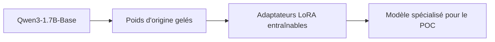
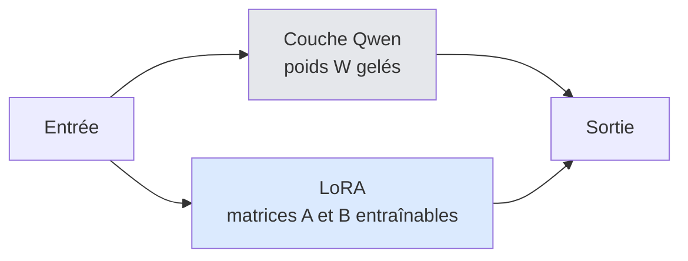
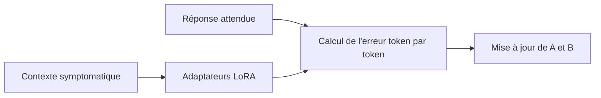
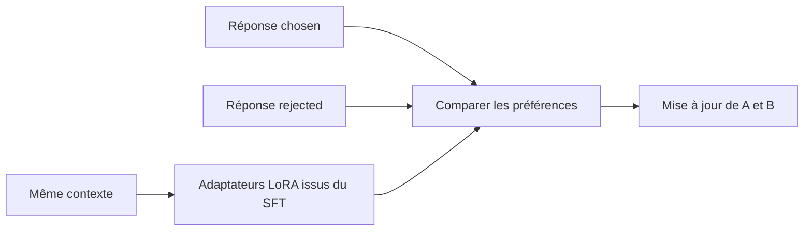

# Étape 4 — Comprendre LoRA, SFT et DPO

- **Date :** 2026-08-28
- **Statut :** draft
- **Source technique associée :** [`../technical/APPRENTISSAGE_SFT_DPO_LORA.md`](../technical/APPRENTISSAGE_SFT_DPO_LORA.md)

## L'idée générale

Le projet ne réentraîne pas entièrement Qwen. Il conserve le modèle de base et lui ajoute de petits adaptateurs LoRA. Ces adaptateurs sont d'abord entraînés par SFT, puis ajustés par DPO.



## LoRA : ce que c'est

LoRA signifie *Low-Rank Adaptation*. Au lieu de modifier une grande matrice de poids `W` du modèle, LoRA apprend une petite correction `ΔW` :

```text
W final = W d'origine + ΔW
ΔW = B × A
```

Les petites matrices `A` et `B` sont les paramètres entraînables. `W` reste gelée. Cela réduit le coût d'entraînement et permet de sauvegarder un adaptateur léger plutôt qu'une copie complète du modèle.



## SFT : apprendre une réponse attendue

Le SFT (*Supervised Fine-Tuning*) montre au modèle un contexte et une réponse cible. Il met à jour les paramètres LoRA afin que cette réponse cible devienne plus probable.



En une phrase : **« pour ce contexte, apprends à produire cette réponse structurée ».**

## DPO : apprendre une préférence

Le DPO (*Direct Preference Optimization*) montre le même contexte avec une réponse `chosen` et une réponse `rejected`. Il met à jour les paramètres LoRA pour rendre `chosen` plus probable que `rejected`.



En une phrase : **« entre ces deux réponses, apprends à préférer celle qui est la plus sûre et la plus conforme ».**

## Différence essentielle

| Question | SFT | DPO |
|---|---|---|
| Donnée d'entrée | Un contexte et une réponse cible | Un contexte, une réponse choisie et une rejetée |
| Signal d'apprentissage | Imitation de la cible | Préférence relative entre deux réponses |
| Poids mis à jour dans ce POC | Paramètres LoRA `A` et `B` | Les mêmes paramètres LoRA, depuis le checkpoint SFT |
| Poids Qwen d'origine | Gelés | Gelés |

## Ce que cela ne garantit pas

LoRA, SFT et DPO sont des techniques d'apprentissage ; elles ne garantissent ni une réponse médicalement correcte, ni l'absence d'hallucination, ni une validation clinique. Cette preuve viendra seulement de l'évaluation sur un jeu isolé et d'une revue clinique documentée.
