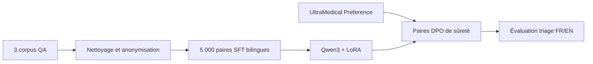

# Construire le vrai SFT depuis les sources

- **Date :** 2026-09-03
- **Statut :** implemented
- **Sources :** ADR-008, manifestes des quatre corpus, générateur `source_medical_qa_sft`

## Le point qui prêtait à confusion

« Utiliser quatre sources » ne signifie pas concaténer les quatre fichiers dans le même entraînement. Chaque source a un rôle :

| Source | Contenu utile | Rôle retenu |
|---|---|---|
| MedQuAD | questions-réponses médicales anglaises | SFT |
| MediQAl | questions et réponses médicales françaises | SFT |
| FrenchMedMCQA | QCM médicaux français | SFT |
| UltraMedical-Preference | réponses préférées et rejetées | DPO, étape suivante |

## Ce que fait réellement le SFT

Le SFT montre au modèle des couples `instruction -> réponse attendue`. Ici, l'instruction et la réponse viennent du corpus identifié dans les métadonnées. Le modèle apprend le vocabulaire médical et la manière de répondre à une question médicale en français ou en anglais.

Il n'apprend pas encore une vérité clinique sur les trois niveaux de triage, car les sources QA ne contiennent pas ces labels. En ajouter automatiquement aurait créé de fausses annotations.

## Comment les 5 000 exemples sont choisis

1. Charger uniquement les fichiers sources autorisés et leurs versions épinglées.
2. Exclure les tests amont de MediQAl et FrenchMedMCQA.
3. Trier les candidats par empreinte stable pour rendre le choix reproductible.
4. Dédupliquer les questions normalisées entre les trois sources.
5. Rechercher et masquer les identifiants directs avec Presidio ; rejeter et remplacer une ligne si le contrôle résiduel échoue.
6. Arrêter la sélection aux quotas 2 500/1 500/1 000.
7. Assigner 4 000 exemples au train, 500 à la validation et 500 au test.
8. Rendre uniquement train et validation au format conversationnel Qwen3.

## Schéma mental du projet

## Formulation pour la soutenance

« J'ai séparé les sources selon leur type de supervision. Les corpus QA servent au SFT d'adaptation médicale ; UltraMedical sert ensuite aux préférences DPO. Je n'ai pas converti arbitrairement des bonnes réponses de QCM en niveaux d'urgence. Chaque ligne garde sa provenance, sa licence, ses transformations et son split. »

## Ce que cette étape prouve et ne prouve pas

Elle prouve que le dataset d'entraînement est reproductible, bilingue et traçable jusqu'aux sources. Elle ne prouve ni l'exactitude clinique de chaque réponse ni la capacité finale du modèle à effectuer un triage sûr. Ces questions appartiennent à l'évaluation ultérieure.

## Ce que l'échec intermédiaire a appris

Un outil d'anonymisation généraliste peut dégrader un corpus médical. La première passe confondait notamment des noms de maladies, médicaments ou éléments anatomiques avec des personnes et lieux. Le dataset avait le bon nombre de lignes, mais son contenu n'était pas assez fidèle.

La correction n'a pas consisté à supprimer toute vérification. La détection a été recentrée sur les identifiants directs adaptés à ces sources publiques. Pour de vrais dossiers patients, cette politique serait insuffisante et une gouvernance hospitalière distincte serait obligatoire.

## Étape suivante

Faire un pré-vol du dataset, lancer un court SFT LoRA, comparer la loss train/validation et inspecter des sorties hors test. Ensuite seulement, constituer le dataset DPO de sûreté à partir d'UltraMedical-Preference.
