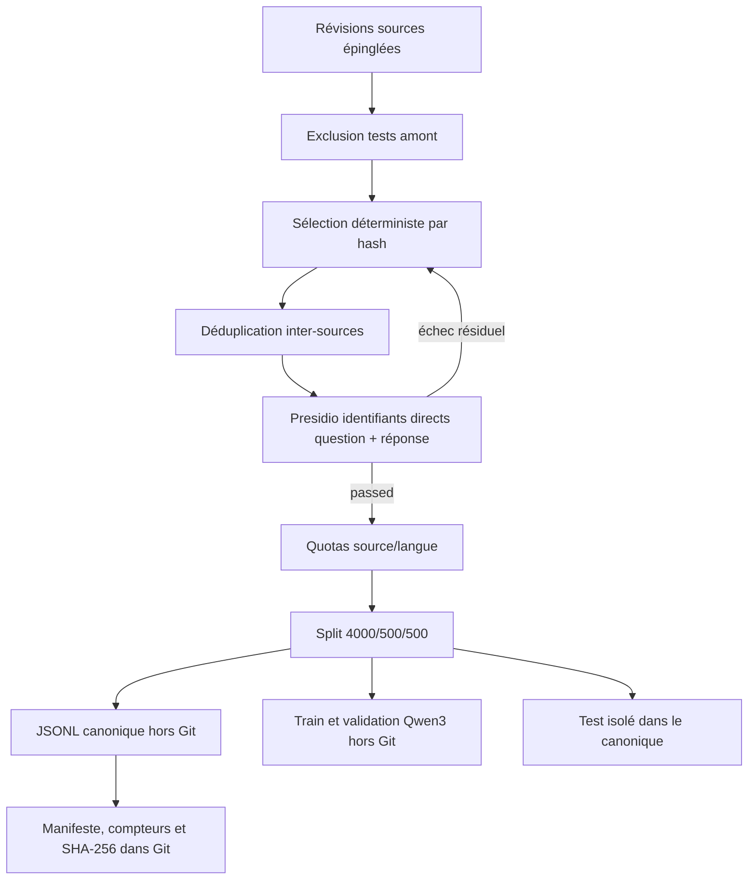

# Dataset SFT médical bilingue dérivé des sources v1

- **Date :** 2026-09-03
- **Statut :** generated and technically validated; clinical review not performed
- **Version :** `source-medical-qa-sft-v1`
- **Sources :** ADR-008, manifestes MedQuAD, MediQAl et FrenchMedMCQA

## Objectif

Produire exactement 5 000 paires instruction-réponse médicales pour le SFT local de Qwen3, sans inventer de réponse ou de niveau de triage.

## Répartition

| Source | Langue | Train | Validation | Test | Total |
|---|---:|---:|---:|---:|---:|
| MedQuAD | anglais | 2 000 | 250 | 250 | 2 500 |
| MediQAl | français | 1 200 | 150 | 150 | 1 500 |
| FrenchMedMCQA | français | 800 | 100 | 100 | 1 000 |
| **Total** | **2 500 FR / 2 500 EN** | **4 000** | **500** | **500** | **5 000** |

UltraMedical-Preference n'entre pas dans ce tableau : sa structure `chosen/rejected` est réservée au DPO.

## Pipeline reproductible



## Contrat d'une ligne

Le schéma `data/manifests/source_medical_qa_sft_v1.schema.json` exige :

- l'instruction et la réponse anonymisées ;
- le manifeste, dataset, licence, identifiant et locator de la source ;
- la liste des transformations et l'identifiant du run ;
- `answer_origin: source_provided` ;
- `clinical_review_status: not_performed` ;
- `triage_label: null` ;
- un split parmi `train`, `validation` et `test`.

## Commande

```bash
PYTHONPATH=src .venv/bin/python scripts/build_source_sft_dataset.py \
  --medquad-repository /controlled/path/medquad \
  --mediqal-repository /controlled/path/mediqal \
  --frenchmedmcqa-rebuilt /controlled/path/frenchmedmcqa-rebuilt \
  --schema data/manifests/source_medical_qa_sft_v1.schema.json \
  --output-directory data/processed/source-sft-v1 \
  --manifest-output data/manifests/derived-source-medical-qa-sft-v1.json \
  --code-revision CODE_REVISION \
  --run-id source-sft-v1-2026-09-03
```

Les chemins contrôlés varient selon la machine et ne sont pas enregistrés dans les lignes. `data/processed/` reste exclu de Git.

## Sorties

- `source-sft-v1.jsonl` : les 5 000 lignes canoniques, test inclus ;
- `train-qwen3.jsonl` : 4 000 conversations ;
- `validation-qwen3.jsonl` : 500 conversations ;
- `derived-source-medical-qa-sft-v1.json` : manifeste text-free versionné.

Le renderer refuse explicitement toute ligne `test`. La génération observée est consignée dans `docs/evidence/GENERATION_SFT_SOURCE_5000_2026-09-04.md`.

## Politique d'anonymisation retenue

Une première passe Presidio incluant `PERSON`, `LOCATION` et `DATE_TIME` a masqué à tort de nombreux termes médicaux. Elle a donc été refusée après l'audit de contenu. La version finale recherche les identifiants directs : téléphone, email, carte bancaire, IBAN, IP et référence patient.

Cette politique préserve les entités médicales dans ces corpus publics, mais ne constitue pas une anonymisation exhaustive de dossiers patients. Elle ne serait pas suffisante pour ingérer des données hospitalières réelles.

## Limites

La sélection est reproductible et les réponses ne sont pas générées, mais cela n'établit pas leur qualité clinique. La déduplication est lexicale, pas sémantique. La génération finale compte 101 réponses MedQuAD tronquées à 4 000 caractères, soit 2,02 % du dataset ; chaque cas est déclaré dans la ligne et le manifeste.
