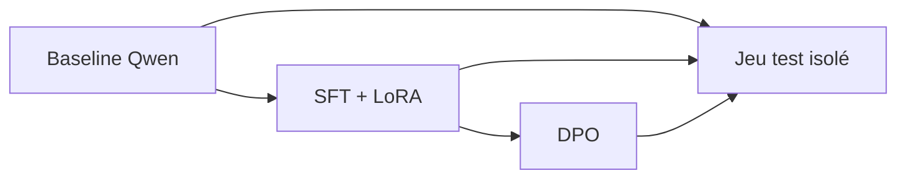

# Expériences baseline, SFT/LoRA et DPO

- **Statut :** observed for synthetic technical baseline and SFT micro-run; governed full runs pending

Les configurations sous `configs/` rendent les trois expériences comparables : même modèle de base, seed documentée, manifests approuvés requis et jeux de validation/test isolés.

Les valeurs LoRA et DPO restent volontairement `proposed`. Elles seront choisies après une baseline et consignées avec les métriques, jamais inventées pour donner l'apparence d'un entraînement effectué.

