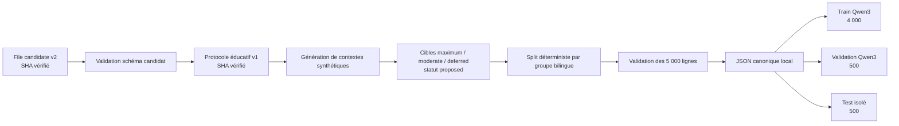

# Génération SFT expérimentale 5 000 v1

- **Date :** 2026-09-03
- **Statut :** implemented and generated — educational use only
- **Code de génération :** `77ff443`
- **Sources :** file candidate v2, protocole expérimental v1, schémas `triage_record_v1` et `educational_sft_dataset_v1`

## Objectif

Produire 5 000 enregistrements canoniques utilisables pour expérimenter le SFT/LoRA sans déclarer de validation clinique. Chaque ligne est synthétique, porte une cible générée par le protocole proposé et conserve la référence du candidat et de la source d'origine.

## Chaîne de transformation



## Transformation d'une ligne

Le générateur utilise `bilingual_group_id`, la langue et la famille demandée pour construire un scénario synthétique déterministe. Le hash du groupe choisit les variations de durée, évolution, intensité, antécédents, traitements et allergies. Les variantes FR/EN d'un groupe reçoivent le même split.

Le bloc `protocol` de chaque enregistrement conserve :

- l'identifiant et le SHA-256 du protocole ;
- `label_status: proposed_protocol_generated` ;
- `intended_use: educational_poc_training_only` ;
- la famille de scénario ;
- l'identifiant du candidat, du manifeste source et de la ligne source.

## Répartition observée

| Dimension | Comptage |
|---|---|
| Total | 5 000 |
| Langues | 2 500 FR, 2 500 EN |
| Splits | 4 000 train, 500 validation, 500 test |
| Labels | 1 826 maximum, 2 254 moderate, 920 deferred |
| Revue clinique | 5 000 pending |
| Doublons exacts de contenu | 0 |
| Fuites de groupe entre splits | 0 |

## Commandes

La génération canonique utilise `scripts/generate_educational_sft_dataset.py`. Les fichiers d'entraînement sont ensuite rendus avec :

```bash
PYTHONPATH=src .venv/bin/python scripts/prepare_sft_dataset.py \
  --input data/processed/educational-sft-v1/educational-sft-v1.json \
  --split train --format qwen3-text \
  --output data/processed/educational-sft-v1/train-qwen3.jsonl

PYTHONPATH=src .venv/bin/python scripts/prepare_sft_dataset.py \
  --input data/processed/educational-sft-v1/educational-sft-v1.json \
  --split validation --format qwen3-text \
  --output data/processed/educational-sft-v1/validation-qwen3.jsonl
```

Le script refuse le split `test` pour la préparation SFT.

## Limite de source-grounding

Les corpus médicaux ont servi à constituer et tracer la file de candidats. Dans cette version, le texte médical source n'est pas injecté dans les scénarios : le contexte est généré par templates à partir de la famille de risque. La relation est donc une référence de provenance, pas une synthèse sémantique vérifiée de chaque réponse source.

Cette version permet d'étudier le format, les garde-fous, l'apprentissage des trois niveaux et la reproductibilité. Elle ne permet pas d'affirmer que le modèle a appris toute la connaissance médicale contenue dans MediQAl, MedQuAD ou FrenchMedMCQA.

## Prochaine porte

Exécuter le pré-vol d'entraînement éducatif, puis un micro-run sur un sous-ensemble avant le run complet. Le test de 500 lignes reste fermé jusqu'à la comparaison finale Base/SFT/DPO.
