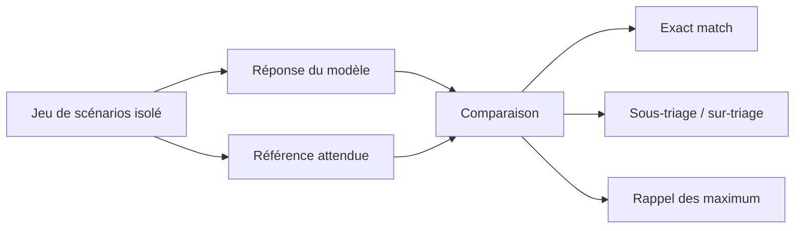

# Protocole d'évaluation v1 — métriques de triage

- **Date :** 2026-08-28
- **Statut :** implemented for metric calculation; clinical thresholds not defined
- **Code :** `src/triage_poc/evaluation.py`

Le module calcule, pour une liste de comparaisons `expected` / `predicted` : taux de correspondance exact, rappel des cas attendus `maximum`, nombre de sous-triages, nombre de sur-triages et matrice de confusion.

L'ordre technique est `deferred < moderate < maximum`. Il sert uniquement à compter les écarts de priorité ; il n'établit aucun protocole clinique ni seuil d'acceptation. Les références synthétiques restent `pending` jusqu'à une revue clinique documentée.
