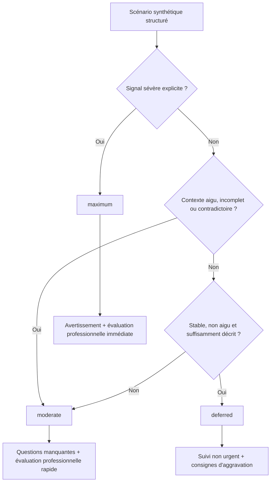
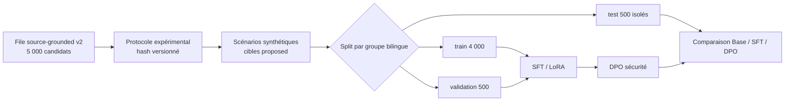

# Protocole de triage expérimental v1

- **Date :** 2026-09-03
- **Statut :** implemented — proposed educational only
- **Version :** `educational-triage-protocol-v1`
- **Sources :** [SFMU — FRENCH 2018 v1.2](https://www.sfmu.org/fr/vie-professionnelle/outils-professionnels/referentiels-sfmu/referentiel-grille-french-2018-de-triage-ioa-version-1-2/ref_id/39), [HAS — fiche Urgences/SAMU-SMUR 2025](https://www.has-sante.fr/upload/docs/application/pdf/2025-05/fiche_pedagogique_6e_cycle_urgences_samu-smur.pdf), ADR-007

## Finalité

Ce protocole fournit une règle reproductible pour générer les références d'un POC scolaire. Il s'inspire de principes publics de triage, sans reproduire ni remplacer la grille FRENCH et sans prétendre qu'un mapping vers `maximum`, `moderate` et `deferred` a été validé médicalement.

La SFMU décrit une échelle utilisée par les professionnels de l'accueil des urgences. La HAS rappelle que le tri réel est effectué par un IDE formé au moyen d'une échelle validée. Le protocole du POC n'est donc qu'un instrument de génération et d'évaluation expérimentales.

## Arbre de décision proposé



Toutes les branches représentent des cibles pédagogiques `proposed`. Elles ne prescrivent aucun délai clinique chiffré.

## Priorité des règles

1. Un signal sévère explicite impose `maximum` dans le scénario synthétique.
2. L'information manquante ou contradictoire ne suffit jamais à produire `deferred`.
3. Un contexte aigu ou une gravité impossible à exclure produit au minimum `moderate`.
4. `deferred` est réservé aux scénarios synthétiques stables, non aigus, suffisamment décrits et sans signal sévère explicite.

## Signaux sévères proposés

Le protocole utilise cinq familles textuelles générales : douleur thoracique intense et persistante, difficulté respiratoire sévère, déficit neurologique focal brutal, altération de la conscience et dégradation sévère explicitement décrite.

Ces catégories servent à fabriquer des cas de test. Elles ne constituent ni une liste médicale exhaustive, ni des critères cliniques validés.

## Contrat du dataset



Les variantes FR/EN d'un même groupe ne peuvent pas être séparées. Le test est figé avant tout réglage d'hyperparamètre.

## Statuts obligatoires

| Élément | Statut autorisé sans médecin | Interprétation |
|---|---|---|
| Protocole | `proposed_educational_only` | règle de l'expérience, non règle clinique |
| Origine | `synthetic` | aucun dossier patient réel |
| Cible | `proposed_protocol_generated` | vérité de référence interne au POC |
| Revue clinique | `pending` | aucune validation médicale effectuée |
| Usage | `educational_poc_training_only` | entraînement local et démonstration scolaire |
| Claim clinique | interdit | aucune conclusion patient ou hôpital |

## Validation automatique

```bash
PYTHONPATH=src .venv/bin/python scripts/validate_educational_protocol.py \
  --protocol configs/educational_triage_protocol_v1.json \
  --schema data/manifests/educational_triage_protocol_v1.schema.json
```

Le schéma impose notamment : les trois labels, la précédence conservatrice, neuf familles, 5 000 enregistrements, les splits 4 000/500/500, l'absence de validation clinique et l'interdiction de classer `deferred` uniquement faute d'information.

## Limites

Le protocole ne prouve ni qualité clinique, ni exhaustivité des signaux d'alerte, ni conformité à l'organisation réelle d'un service d'urgence. Toute évolution vers un pilote hospitalier exigerait une revue clinique, juridique, organisationnelle et réglementaire distincte.
