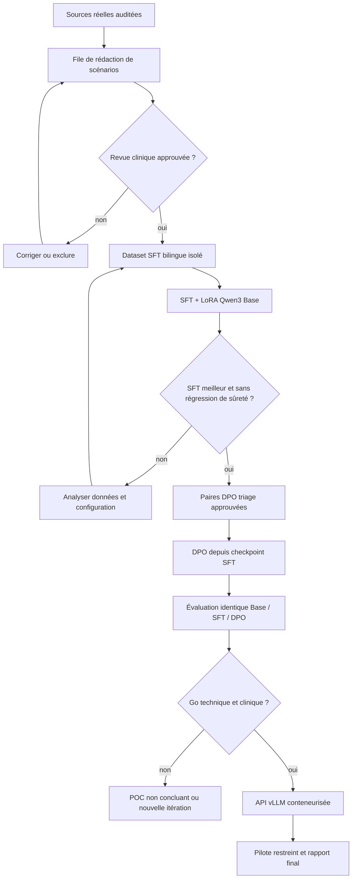

# Roadmap de réalisation du POC de triage médical

- **Date :** 2026-08-31
- **Statut :** active — mise à jour après audit des quatre sources et reconstruction DPO
- **Périmètre :** réalisation du POC défini par `CADRAGE_MISSION.md` et `SPEC_POC_TRIAGE_MEDICAL.md`
- **Sources :** cadrage de mission, spécification, manifestes de données, ADR-001 à ADR-005 et preuves versionnées dans `docs/evidence/`

## Lecture de l'état

- `proven` : résultat observé et associé à une preuve reproductible.
- `partially proven` : une partie technique est observée, mais le livrable attendu n'est pas terminé.
- `implemented only` : code ou contrat présent, sans preuve directe du comportement final.
- `not started` : aucun résultat exécutable correspondant au livrable final.
- `blocked by clinical decision` : la suite exige une décision ou une validation qui ne peut pas être inventée par l'équipe technique.

Un statut technique vert ne constitue jamais une validation clinique.

## État par rapport aux quatre semaines du cadrage

| Phase du cadrage | État au 2026-08-31 | Résultat prouvé | Écart à fermer |
|---|---|---|---|
| Semaine 1 — données | `partially proven` | Les quatre sources sont acquises à des révisions immuables, auditées et documentées. Les fuites FrenchMedMCQA et UltraMedical-Preference sont mesurées et reconstruites. Presidio et les contrats de données sont testés. | Produire environ 5 000 paires SFT bilingues, source-grounded, anonymisées et approuvées ; produire les paires DPO spécifiques au triage ; isoler le test clinique. |
| Semaine 2 — SFT/LoRA | `partially proven` | Qwen3-1.7B-Base est accessible localement. La baseline synthétique et un micro-run LoRA synthétique de 20 étapes sont observés. La configuration Unsloth Core/MLX est reproductible. | Entraîner sur le dataset réel approuvé, conserver checkpoint, logs et métriques de validation, puis comparer à la baseline avec le même protocole. |
| Semaine 3 — DPO | `not started` pour l'entraînement | Les 112 362 préférences UltraMedical sont auditées ; un index sans texte reconstruit les splits et protège le test. | Sélectionner des préférences compatibles avec le triage, les anonymiser et les faire valider ; entraîner depuis le checkpoint SFT validé ; mesurer le gain et les régressions. |
| Semaine 4 — API et pilote | `implemented only` | Contrat FastAPI, garde-fous de schéma, audit minimal, tests, Dockerfile et CI sont présents. | Brancher le modèle validé, prouver le build Docker, servir avec vLLM, mesurer latence et débit, déployer sur une cible explicitement autorisée et réaliser un smoke test. |

La durée de quatre semaines du mandat n'est pas déclarée tenue. La roadmap est désormais pilotée par preuves et portes de décision, car la disponibilité d'une validation clinique conditionne le chemin critique.

## Chemin critique

## Plan d'exécution actualisé

### Jalon 1 — Dataset SFT gouverné

- **Statut :** file de 5 000 candidats `proven` techniquement ; dataset SFT `blocked by clinical decision` pour les scénarios et cibles.
- **Entrées :** MedQuAD, MEDIQA et FrenchMedMCQA comme sources documentaires ; scénarios synthétiques pour éviter toute donnée patient réelle.
- **Travail :** construire une file d'environ 5 000 candidats bilingues avec provenance ; laisser `triage_level` vide tant qu'il n'est pas approuvé ; appliquer Presidio ; dédupliquer ; reconstruire les splits par groupe de scénario.
- **Porte de sortie :** chaque ligne utilisée par le SFT porte `clinical_review_status: approved`, `pii_anonymization_status: passed`, une licence, une provenance et un split sans fuite.
- **Preuve attendue :** manifeste du dataset, checksums, distribution FR/EN et par risque, rapport de revue, tests de contrats et de fuite.

### Jalon 2 — Baseline de référence figée

- **Statut :** `partially proven`.
- **Travail :** conserver la baseline actuelle comme preuve de faisabilité, puis exécuter Qwen3-1.7B-Base sur le jeu de test clinique approuvé sans ajuster le modèle à ses résultats.
- **Porte de sortie :** versions, prompt, seed, garde-fous, sorties et métriques enregistrés pour chaque scénario.
- **Preuve attendue :** rapport Base avec conformité JSON, rappel des cas `maximum`, sous-triage, sur-triage, réponses dangereuses et limites de la revue.

### Jalon 3 — SFT + LoRA réel

- **Statut :** `not started` sur données approuvées.
- **Travail :** exécuter d'abord un court run contrôlé, puis le run SFT complet ; suivre loss entraînement/validation, stabilité, mémoire et durée ; sauvegarder adaptateur et état de reprise.
- **Porte de sortie :** checkpoint reproductible et amélioration mesurée par rapport à Base sans hausse non acceptée des erreurs dangereuses.
- **Preuve attendue :** configuration figée, hash du code et des données, logs, checkpoint, métriques et comparaison au même jeu de test.

### Jalon 4 — Dataset et entraînement DPO

- **Statut :** reconstruction de source `proven`, sélection triage `not started`.
- **Entrées :** index UltraMedical reconstruit et préférences créées ou revues pour le contrat de triage.
- **Travail :** exclure le benchmark de test, filtrer les préférences génériques, anonymiser le sous-ensemble retenu et documenter pourquoi `chosen` est plus sûr que `rejected`.
- **Porte de sortie :** toutes les préférences d'entraînement sont approuvées et le DPO démarre depuis le checkpoint SFT validé.
- **Preuve attendue :** manifeste DPO, distribution des types de préférence, checkpoint et comparaison Base/SFT/DPO.

### Jalon 5 — Évaluation de sûreté

- **Statut :** protocole `implemented`, validation clinique `not started`.
- **Périmètre minimal :** douleur thoracique, détresse respiratoire, déficit neurologique, pédiatrie, grossesse, vulnérabilité, données insuffisantes ou contradictoires, français et anglais.
- **Travail :** mesurer rappel des cas critiques, sous-triage, sur-triage, recommandations dangereuses, qualité des explications et questions complémentaires.
- **Porte de sortie :** seuils d'acceptation proposés par l'équipe puis approuvés par les référents cliniques ; aucun résultat non concluant n'est masqué.
- **Preuve attendue :** métriques automatiques, revue humaine séparée et validation clinique explicitement identifiée.

### Jalon 6 — API intégrée et observabilité

- **Statut :** contrat `implemented only`.
- **Travail :** remplacer le fournisseur synthétique par l'inférence du modèle validé ; journaliser versions, contrôles et latence sur des entrées anonymisées ; vérifier l'escalade quand le contexte est incomplet ou contradictoire.
- **Porte de sortie :** `POST /v1/triage` retourne uniquement le contrat prévu avec un modèle réel, un identifiant d'interaction et l'avertissement de sécurité.
- **Preuve attendue :** tests d'intégration, exécution d'inférence, audit de logs sans PII et cas d'échec observés.

### Jalon 7 — Packaging, vLLM, CI/CD et pilote

- **Statut :** CI présente ; build Docker, vLLM et déploiement `not proven`.
- **Travail :** prouver le build et le démarrage du conteneur ; configurer vLLM dans un environnement compatible ; mesurer p50/p95, taux d'erreur et débit ; définir la cible cloud avant toute mutation externe.
- **Porte de sortie :** pipeline vert, endpoint pilote restreint, smoke test et monitoring observés sur la même version.
- **Preuve attendue :** digest d'image, version du déploiement, logs de CI, mesures de performance et smoke test autorisé.

### Jalon 8 — Rapport final et décision go / no-go

- **Statut :** squelette `implemented`, contenu final `not started`.
- **Travail :** consolider uniquement les preuves versionnées, y compris résultats négatifs, limites juridiques et cliniques, coûts, contraintes d'hébergement et conditions de passage à l'échelle.
- **Porte de sortie :** rapport de 20 pages maximum, relu, sans affirmation clinique non étayée.
- **Décision :** le POC peut être techniquement démontré sans être autorisé pour un usage clinique réel.

## Incrément réalisé — file de rédaction de 5 000 candidats

La file unifiée a été générée localement à partir des sources réelles auditées. Elle n'est pas appelée « dataset SFT » : elle conserve `triage_level: null`, `split: null`, `training_eligible: false` et `clinical_review_status: not_started`. L'incrément produit :

1. une stratégie versionnée de quotas FR/EN et par famille de rédaction ;
2. un générateur déterministe et traçable ;
3. un passage Presidio sans persistance des valeurs détectées ;
4. un index de provenance sans texte et des checksums ;
5. 50 paquets de revue humaine de 100 lignes ;
6. une preuve des 5 000 candidats, 47 rejets PII résiduels rencontrés et 18 doublons exacts ignorés.

Le prochain incrément est un pilote de revue humaine sur un seul paquet de 100. Son but est de mesurer la pertinence des ancrages, les faux positifs d'anonymisation et la clarté du protocole avant toute rédaction à grande échelle. La production des réponses et labels reste bloquée sur la désignation et l'approbation des référents cliniques.

## Décisions externes nécessaires

Le projet ne peut pas franchir seul les portes suivantes :

- désignation du ou des référents cliniques ;
- approbation de la taxonomie, des règles d'escalade et des seuils d'acceptation ;
- validation des scénarios SFT et des préférences DPO ;
- décision juridique et RGPD finale ;
- autorisation et cible exacte d'un déploiement pilote ;
- décision go / no-go au-delà du POC.
