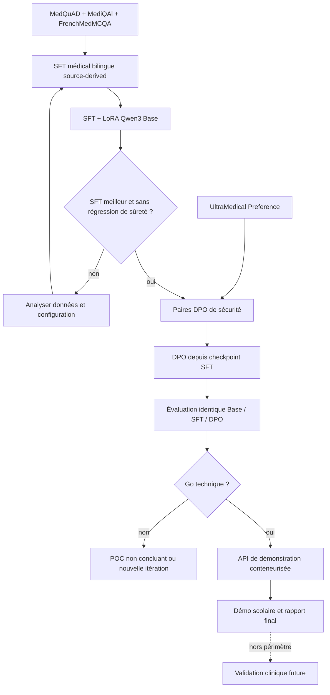

# Roadmap de réalisation du POC de triage médical

- **Date :** 2026-09-05
- **Statut :** active — SFT complet terminé ; comparaison, DPO et intégration en cours
- **Périmètre :** réalisation du POC défini par `CADRAGE_MISSION.md` et `SPEC_POC_TRIAGE_MEDICAL.md`
- **Sources :** cadrage de mission, spécification, manifestes de données, ADR-001 à ADR-008 et preuves versionnées dans `docs/evidence/`

## Lecture de l'état

- `proven` : résultat observé et associé à une preuve reproductible.
- `partially proven` : une partie technique est observée, mais le livrable attendu n'est pas terminé.
- `implemented only` : code ou contrat présent, sans preuve directe du comportement final.
- `not started` : aucun résultat exécutable correspondant au livrable final.
- `blocked for clinical claims` : l'expérimentation technique peut continuer, mais aucune conclusion clinique n'est autorisée.

Un statut technique vert ne constitue jamais une validation clinique.

## État par rapport aux quatre semaines du cadrage

| Phase du cadrage | État au 2026-09-04 | Résultat prouvé | Écart à fermer |
|---|---|---|---|
| Semaine 1 — données | `proven` pour le SFT, DPO restant | Les 5 000 paires source-derived sont générées et vérifiées : 2 500 FR/2 500 EN, splits 4 000/500/500, réponses sources et zéro label de triage inventé. | Constituer le DPO depuis UltraMedical après le premier SFT LoRA. |
| Semaine 2 — SFT/LoRA | `partially proven` | Le pré-vol des 4 000/500 lignes et un micro-run LoRA source-derived de 20 étapes sont terminés ; l'adaptateur est sauvegardé. | Définir puis exécuter le run complet, évaluer tout le split validation et comparer à la baseline. |
| Semaine 3 — DPO | `not started` pour l'entraînement | Les 112 362 préférences UltraMedical sont auditées ; un index sans texte reconstruit les splits et protège le test. | Créer ou sélectionner des préférences de sûreté proposées, entraîner depuis le checkpoint SFT source-derived et mesurer gains et régressions. |
| Semaine 4 — API et pilote | `implemented only` | Contrat FastAPI, garde-fous de schéma, audit minimal, tests, Dockerfile et CI sont présents. | Brancher le modèle validé, prouver le build Docker, servir avec vLLM, mesurer latence et débit, déployer sur une cible explicitement autorisée et réaliser un smoke test. |

La durée de quatre semaines du mandat n'est pas déclarée tenue. La roadmap est pilotée par preuves. L'absence de validation clinique limite les conclusions et tout usage patient, mais ne bloque plus le chemin technique du projet scolaire.

## Chemin critique

## Plan d'exécution actualisé

### Jalon 1 — Dataset SFT médical gouverné

- **Statut :** dataset source-derived `proven` techniquement ; validation clinique `not performed`.
- **Entrées :** questions et réponses MedQuAD, MediQAl et FrenchMedMCQA ; UltraMedical est réservé au DPO.
- **Travail :** sélectionner 5 000 paires sources, les dédupliquer et anonymiser, puis assigner 4 000/500/500 sans créer de label de triage.
- **Porte de sortie :** 2 500 FR, 2 500 EN, toutes les réponses `source_provided`, provenance et licence présentes, zéro label de triage inventé et test non rendu pour l'entraînement.
- **Preuve :** manifeste, SHA-256, distributions, contrôles de schéma, doublons, identifiants directs et isolation du test dans `GENERATION_SFT_SOURCE_5000_2026-09-04.md`.

### Jalon 2 — Baseline de référence figée

- **Statut :** `partially proven`.
- **Travail :** conserver la baseline actuelle comme preuve de faisabilité, puis exécuter Qwen3-1.7B-Base sur le jeu de test expérimental isolé sans ajuster le modèle à ses résultats.
- **Porte de sortie :** versions, prompt, seed, garde-fous, sorties et métriques enregistrés pour chaque scénario.
- **Preuve attendue :** rapport Base avec conformité JSON, rappel des cas `maximum`, sous-triage, sur-triage, réponses dangereuses et limites de la revue.

### Jalon 3 — SFT + LoRA sur les sources

- **Statut :** SFT complet `proven` techniquement ; comparaison Base/SFT `proven` sur validation QA ; génération à diagnostiquer.
- **Travail :** le micro-run contrôlé est terminé ; définir puis exécuter le run SFT complet, suivre loss entraînement/validation, stabilité, mémoire et durée, puis sauvegarder adaptateur et état de reprise.
- **Porte de sortie :** checkpoint reproductible et amélioration mesurée par rapport à Base sans hausse non acceptée des erreurs dangereuses.
- **Preuve attendue :** configuration figée, hash du code et des données, logs, checkpoint, métriques et comparaison au même jeu de test.

### Jalon 4 — Dataset et entraînement DPO

- **Statut :** reconstruction de source `proven`, sélection triage `not started`.
- **Entrées :** index UltraMedical reconstruit et préférences créées ou revues pour le contrat de triage.
- **Travail :** exclure le benchmark de test, filtrer ou générer les préférences de sûreté et documenter pourquoi `chosen` est préférable à `rejected` selon le protocole expérimental.
- **Porte de sortie expérimentale :** les préférences portent un statut proposé explicite et le DPO démarre depuis le checkpoint SFT retenu ; aucune approbation clinique n'est déclarée.
- **Preuve attendue :** manifeste DPO, distribution des types de préférence, checkpoint et comparaison Base/SFT/DPO.

### Jalon 5 — Évaluation de sûreté

- **Statut :** protocole `implemented`, validation clinique `not started`.
- **Périmètre minimal :** douleur thoracique, détresse respiratoire, déficit neurologique, pédiatrie, grossesse, vulnérabilité, données insuffisantes ou contradictoires, français et anglais.
- **Travail :** mesurer rappel des cas critiques, sous-triage, sur-triage, recommandations dangereuses, qualité des explications et questions complémentaires.
- **Porte de sortie expérimentale :** seuils d'analyse proposés par l'équipe, résultats automatiques séparés de toute validation clinique et aucun résultat non concluant masqué.
- **Preuve attendue :** métriques automatiques, revue humaine séparée et validation clinique explicitement identifiée.

### Jalon 6 — API intégrée et observabilité

- **Statut :** contrat et transport simulé `proven` localement ; inférence réelle `not proven`.
- **Travail :** remplacer le fournisseur synthétique par l'inférence du meilleur checkpoint expérimental ; journaliser versions, contrôles et latence sur des entrées synthétiques ; vérifier l'escalade quand le contexte est incomplet ou contradictoire.
- **Porte de sortie :** `POST /v1/triage` retourne uniquement le contrat prévu avec un modèle réel, un identifiant d'interaction et l'avertissement de sécurité.
- **Preuve attendue :** tests d'intégration, exécution d'inférence, audit de logs sans PII et cas d'échec observés.

### Jalon 7 — Packaging, vLLM, CI/CD et pilote

- **Statut :** build Docker et smoke sans réseau `proven` localement ; CI distante, vLLM et déploiement `not proven`.
- **Travail :** prouver le build et le démarrage du conteneur ; configurer vLLM dans un environnement compatible ; mesurer p50/p95, taux d'erreur et débit ; définir la cible cloud avant toute mutation externe.
- **Porte de sortie :** pipeline vert, endpoint pilote restreint, smoke test et monitoring observés sur la même version.
- **Preuve attendue :** digest d'image, version du déploiement, logs de CI, mesures de performance et smoke test autorisé.

### Jalon 8 — Rapport final et décision go / no-go

- **Statut :** rapport intermédiaire renseigné ; clôture finale dépendante des preuves manquantes.
- **Travail :** consolider uniquement les preuves versionnées, y compris résultats négatifs, limites juridiques et cliniques, coûts, contraintes d'hébergement et conditions de passage à l'échelle.
- **Porte de sortie :** rapport de 20 pages maximum, relu, sans affirmation clinique non étayée.
- **Décision :** le POC peut être techniquement démontré sans être autorisé pour un usage clinique réel.

## Incrément réalisé — file de rédaction de 5 000 candidats v2

La file unifiée a été générée localement à partir des sources réelles auditées. Elle n'est pas appelée « dataset SFT » : elle conserve `triage_level: null`, `split: null`, `training_eligible: false` et `clinical_review_status: not_started`. L'incrément produit :

1. une stratégie versionnée de quotas FR/EN et par famille de rédaction ;
2. un générateur déterministe et traçable ;
3. un passage Presidio sans persistance des valeurs détectées ;
4. un index de provenance sans texte et des checksums ;
5. 50 paquets de revue humaine de 100 lignes ;
6. une preuve des 5 000 candidats, 98 rejets PII résiduels rencontrés et 19 doublons exacts ignorés ;
7. le remplacement traçable de MEDIQA 2019 par MediQAl, avec exclusion des tests et de leurs recouvrements lexicaux.

La préparation du pilote a révélé que le premier paquet séquentiel ne couvrait que `chest_pain`. Un échantillon stratifié séparé est donc nécessaire pour la revue de qualité. La production expérimentale des réponses et labels peut désormais continuer sous ADR-007.

## Incrément réalisé — préparation de la revue pilote 001

Le lot séquentiel initial étant limité à `chest_pain`, un pilote stratifié a été créé à partir de la file v2. Il contient 50 groupes bilingues couvrant les neuf familles et les trois sources. Son schéma et son manifeste sont versionnés ; le texte reste local et toutes les décisions sont `pending`.

La revue documentaire peut être réalisée par l'équipe POC. Elle informe la qualité du dataset, sans être présentée comme une approbation clinique.

## Incrément réalisé — protocole expérimental scolaire

ADR-007 autorise l'entraînement local sur des cibles synthétiques `proposed_protocol_generated`. Le protocole machine-readable fixe les trois niveaux, la précédence conservatrice, la politique d'incertitude, les neuf familles et les splits 4 000/500/500. Il conserve explicitement `clinical_review_status: pending`.

## Incrément historique — dataset SFT template 5 000

Le générateur canonique a produit 4 000 lignes train, 500 validation et 500 test, toutes synthétiques et liées au protocole et à leur candidat source. Il reste une preuve technique reproductible du pipeline.

ADR-008 le reclasse comme fixture supplantée pour le SFT principal : la génération est template-based et ne prouve pas un grounding sémantique sur les réponses des corpus. Le nouveau dataset conserve directement les questions-réponses sources et ne génère aucun label de triage.

## Incrément réalisé — SFT source-derived 5 000

Le pipeline utilise MedQuAD pour 2 500 exemples anglais, MediQAl pour 1 500 exemples français et FrenchMedMCQA pour 1 000 exemples français. UltraMedical-Preference reste séparé pour le DPO. La sélection, l'anonymisation des identifiants directs, la déduplication et les splits sont déterministes et manifestés.

La première passe complète a été refusée car le NER généraliste masquait des termes médicaux. La version finale préserve ces entités, masque 1 email et 12 téléphones, conserve 5 000 questions uniques et déclare 101 réponses MedQuAD tronquées. Le dataset est prêt pour le pré-vol d'un SFT local, sans être cliniquement validé.

## Incrément réalisé — micro-run SFT source-derived

Le pré-vol Qwen3 couvre 4 000 lignes train et 500 validation, avec zéro test rendu et aucune séquence au-dessus de 2 048 tokens. Unsloth Core/MLX a ensuite terminé 20 étapes LoRA, traité 40 574 tokens et sauvegardé l'adaptateur local. Les métriques portent sur un smoke test et ne permettent pas de conclure à une amélioration du triage.

## Décisions externes nécessaires au-delà du POC scolaire

Les décisions suivantes ne bloquent pas l'expérimentation scolaire, mais restent obligatoires avant toute prétention ou utilisation clinique :

- désignation du ou des référents cliniques ;
- approbation de la taxonomie, des règles d'escalade et des seuils d'acceptation ;
- validation des scénarios SFT et des préférences DPO ;
- décision juridique et RGPD finale ;
- autorisation et cible exacte d'un déploiement pilote ;
- décision go / no-go au-delà du POC.

## Incrément post-SFT du 5 septembre 2026

Voir [la preuve locale](../evidence/POST_SFT_IMPLEMENTATION_2026-09-05.md), [la comparaison](COMPARAISON_POST_SFT_V1.md) et [le contrat API privé](API_MODELE_PRIVE_V2.md). Le SFT v5 et la comparaison v8 sont archivés. Le SFT réduit la loss mais ses générations nécessitent un diagnostic avant DPO. Le diagnostic v9 n’a pas atteint l’inférence à cause de l’attachement des poids. Le lot DPO v2 contient 512/64 candidats, sans approbation clinique. L'API a un fournisseur compatible vLLM, mais son inférence réelle reste à prouver. Le rapport conserve ces écarts explicitement.
