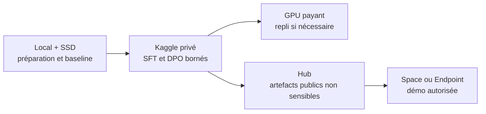

# Stratégie d'exécution hybride — local, Kaggle et services managés

- **Date :** 2026-09-04
- **Statut :** approved for educational implementation
- **Sources :** micro-run SFT source-derived, ADR-009, configuration SFT Kaggle

## Répartition retenue

| Surface | Rôle |
|---|---|
| Mac + SSD externe | Code, données candidates, cache Hugging Face, modèles, checkpoints et tests locaux |
| Kaggle privé | Premier SFT complet et futurs runs GPU bornés lorsque le quota gratuit suffit |
| Hugging Face Hub | Récupération/versionnement des modèles et datasets publics ; publication éventuelle d'artefacts non sensibles |
| Hugging Face Spaces | Démonstration interactive après entraînement, pas environnement d'entraînement principal |
| Hugging Face Inference Endpoints | API managée seulement lorsque le modèle est prêt et le coût autorisé |
| GPU cloud payant | Repli pour les jobs LoRA/DPO si Kaggle devient insuffisant ou indisponible |

## Règles

- Configurer les caches et artefacts lourds sur le SSD, hors Git.
- Garder privés le notebook et le dataset Kaggle de travail ; le caractère privé ne permet toujours pas d'y envoyer des données patient ou des secrets.
- Exclure le split `test` des bundles d'entraînement Kaggle.
- Télécharger les sorties utiles depuis `/kaggle/working` et vérifier leurs checksums avant archivage.
- Ne jamais envoyer de données patient ou de secrets vers Kaggle, Hugging Face ou un autre cloud.
- Utiliser localement les scénarios synthétiques et les contrôles de préparation.
- Ne créer aucun Space, Endpoint ou job cloud sans cible, budget et autorisation explicites.
- Traiter le disque d'un Space comme éphémère sans volume attaché ; ne pas y conserver checkpoints ou données de travail.

## Trajectoire

Le premier SFT complet a été lancé sur Kaggle. Son statut `Running` prouve le démarrage de l'exécution distante, pas son achèvement, la qualité du modèle ou une validation clinique. Les résultats finaux seront consignés séparément dans `docs/evidence/`.
