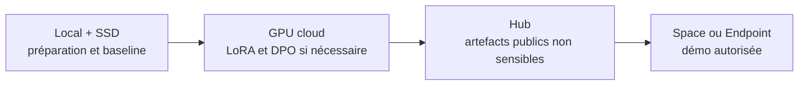

# Stratégie d'exécution hybride — local, Hugging Face et cloud

- **Statut :** proposed

## Répartition retenue

| Surface | Rôle |
|---|---|
| Mac + SSD externe | Code, données candidates, cache Hugging Face, modèles, checkpoints et tests locaux |
| Hugging Face Hub | Récupération/versionnement des modèles et datasets publics ; publication éventuelle d'artefacts non sensibles |
| Hugging Face Spaces | Démonstration interactive après entraînement, pas environnement d'entraînement principal |
| Hugging Face Inference Endpoints | API managée seulement lorsque le modèle est prêt et le coût autorisé |
| Google Cloud / Vertex AI | Jobs GPU LoRA/DPO reproductibles si les ressources locales sont insuffisantes |

## Règles

- Configurer les caches et artefacts lourds sur le SSD, hors Git.
- Ne jamais envoyer de données patient ou de secrets vers Hugging Face, Spaces ou Google Cloud.
- Utiliser localement les scénarios synthétiques et les contrôles de préparation.
- Ne créer aucun Space, Endpoint ou job cloud sans cible, budget et autorisation explicites.
- Traiter le disque d'un Space comme éphémère sans volume attaché ; ne pas y conserver checkpoints ou données de travail.

## Trajectoire

Cette stratégie ne prouve pas encore une exécution cloud ou une démo hébergée : aucune ressource externe n'a été créée.
