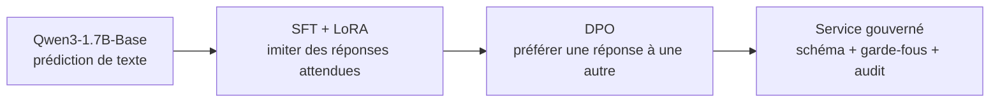
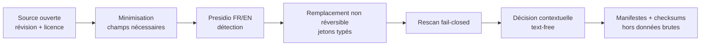
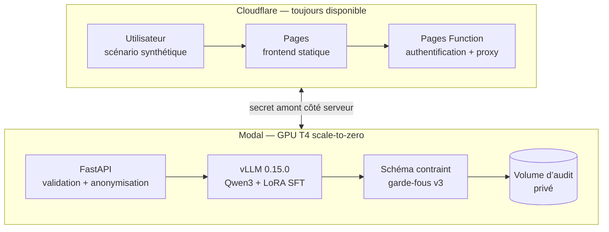
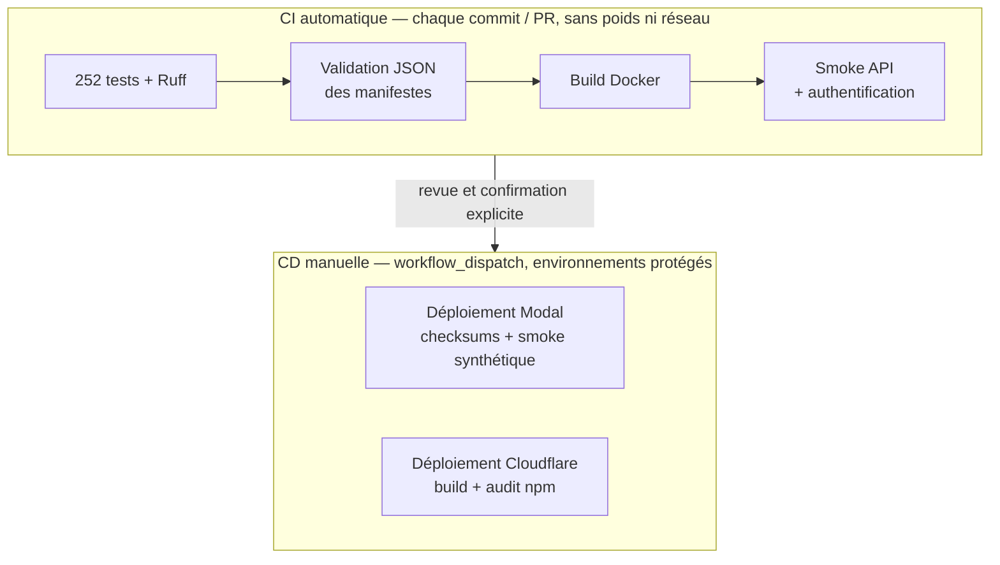
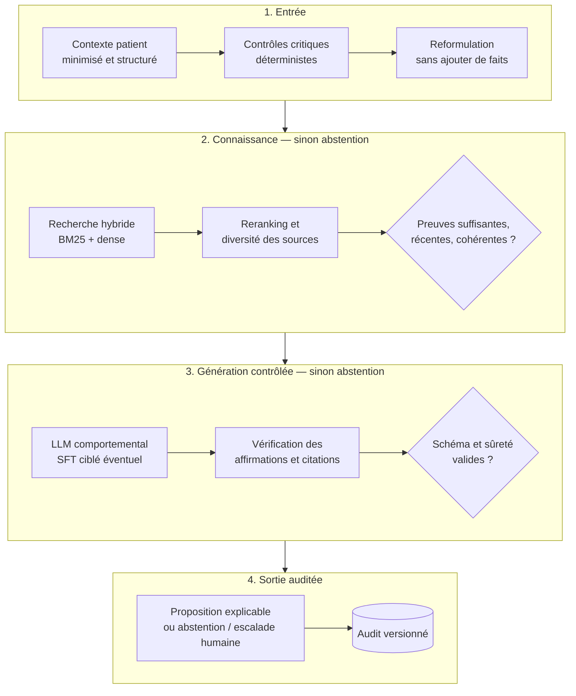

# Rapport technique et recommandations stratégiques

## POC d’assistance au triage médical — Centre Hospitalier Saint-Aurélien

- **Date :** 21 septembre 2026
- **Statut :** `final_candidate` — contenu figé sous réserve de relecture finale
- **Périmètre :** données, entraînement SFT/LoRA et DPO, évaluation, API, déploiement cloud, CI/CD et trajectoire vers un système fondé sur des preuves
- **Format :** document Word A4 (20 pages maximum) ; version PDF générée par `scripts/build_report_pdf.py`
- **Nature du projet :** preuve de concept pédagogique sur données ouvertes et scénarios synthétiques
- **Limite essentielle :** ce POC n’est ni un dispositif médical, ni un outil de diagnostic, ni un système de décision clinique autonome

---

## Résumé exécutif

Le projet étudie la faisabilité d’un assistant conversationnel capable de recueillir un contexte patient, de proposer un niveau de priorité parmi `maximum`, `moderate` et `deferred`, d’expliquer sa proposition et de conserver une trace auditable. Le modèle imposé par le cadrage est **Qwen3-1.7B-Base**, adapté en deux étapes : un apprentissage supervisé par **SFT avec LoRA**, puis un alignement par préférences par **DPO**. Le système complet ajoute une API FastAPI, une inférence vLLM, des garde-fous déterministes, un journal d’audit, un déploiement GPU sur Modal, un frontend Cloudflare Pages et une chaîne CI/CD GitHub Actions.

Le travail a permis de construire une chaîne technique complète et reproductible : inventaire et versionnement des sources, corpus bilingue, contrôles de confidentialité, séparation stricte des jeux, entraînements sur GPU, comparaison Base/SFT/DPO, conteneurisation, endpoint protégé et démonstration publique sur scénarios synthétiques. Le corpus SFT final contient **4 700 paires** : 3 721 pour l’entraînement, 479 pour la validation et 500 conservées pour le test. Il comprend 2 474 exemples français et 2 226 exemples anglais. Le lot DPO contient 426 paires d’entraînement et 54 de validation.

Les résultats sont contrastés. Sur un protocole de développement commun, le SFT réduit la NLL moyenne de **1,532045 à 0,830098**, soit environ **45,8 %**, et réduit la répétition de 4-grammes d’environ **30,6 %**. Le DPO améliore encore légèrement la NLL, la terminaison et la répétition, mais n’augmente pas le nombre de réponses exactes. Surtout, ces gains portent sur la capacité à reproduire la distribution des réponses médicales du corpus, et non sur la justesse du triage. Sans schéma contraint ni garde-fous, SFT et DPO ne produisent chacun qu’un seul JSON valide sur 18 scénarios de développement. Le SFT retenu échoue ensuite sur les 18 scénarios de réserve : 0 JSON conforme, 17 générations au plafond, des répétitions importantes et au moins six faits patient inventés.

Placé derrière l’API, le décodage contraint et les garde-fous déterministes, le système produit des réponses valides et retrouve les 6 cas critiques proposés sur le lot de développement. Mais les garde-fous corrigent ou remplacent la majorité des sorties : seules 5 réponses SFT sur 18 sont restituées telles quelles. La priorité observée est donc surtout celle des règles, pas celle du modèle.

Le constat principal n’est donc pas que « le fine-tuning ne fonctionne pas ». Le SFT a bien appris son objectif. Le problème est un **désalignement entre les données et l’usage final** : les sources SFT sont principalement des questions-réponses médicales et des QCM, sans annotation de priorité de triage ; les préférences DPO sont généralistes, uniquement en anglais et non validées pour le triage. Un petit modèle peut apprendre à mieux répondre à ces données sans apprendre à distinguer de façon fiable l’urgence, l’information absente ou l’obligation de s’abstenir.

La recommandation stratégique est donc de ne pas prolonger immédiatement le DPO actuel. La trajectoire la plus crédible consiste à :

1. conserver le fine-tuning pour le **comportement stable** — format, ton, bilinguisme, collecte structurée et abstention — uniquement avec des données ciblées et revues ;
2. utiliser un **RAG hybride et correctif** pour la connaissance médicale actualisable, versionnée et citable ;
3. maintenir les **règles critiques hors du LLM**, dans des garde-fous déterministes approuvés ;
4. évaluer séparément la récupération documentaire, la fidélité aux sources, la qualité de réponse, le sous-triage critique, l’abstention, la latence et le coût ;
5. exiger une revue clinique indépendante avant toute affirmation de performance ou tout pilote impliquant des données réelles.

Le POC justifie donc sa valeur par deux résultats. Premièrement, il démontre qu’une infrastructure gouvernée, traçable et peu coûteuse peut être construite de bout en bout. Deuxièmement, il montre par des preuves reproductibles pourquoi cette infrastructure ne doit pas être confondue avec une validation clinique du modèle.

---

## 1. Contexte, besoin et question de décision

### 1.1 Le cas d’usage

Dans un service de soins, le triage initial vise à identifier rapidement les situations qui nécessitent une évaluation immédiate, celles qui peuvent être prises en charge avec une priorité intermédiaire et celles qui peuvent attendre. Le POC transpose ce besoin dans une interface conversationnelle limitée à cinq fonctions :

- recueillir les informations disponibles sans inventer les informations absentes ;
- demander des précisions utiles lorsque le contexte est incomplet ;
- proposer l’un des trois niveaux autorisés ;
- expliquer la proposition en distinguant faits observés et incertitudes ;
- produire une trace technique exploitable pour l’audit.

Le terme « proposer » est central. La sortie n’est pas une décision médicale. Le professionnel reste responsable de l’interprétation, de la vérification et de l’action. Aucun résultat de ce rapport ne permet de revendiquer une utilisation hospitalière réelle.

### 1.2 Pourquoi utiliser un LLM ?

Une interface classique à règles peut collecter des champs structurés, mais elle gère moins naturellement la variété du langage, les formulations libres et le bilinguisme. Un LLM peut reformuler, synthétiser et poursuivre une conversation. En contrepartie, il peut produire une réponse plausible mais fausse, omettre une information critique ou compléter le contexte avec un fait absent. Dans un domaine à fort enjeu, la souplesse du langage doit donc être séparée des décisions critiques.

Le POC n’évalue pas la question « un LLM peut-il remplacer un triage clinique ? », dont la réponse opérationnelle reste non. Il évalue plutôt trois questions :

1. un petit modèle ouvert peut-il être adapté à un corpus médical bilingue avec un budget GPU limité ?
2. les étapes SFT puis DPO améliorent-elles des métriques comparables sans dégrader la sécurité observée ?
3. peut-on intégrer ce modèle dans une architecture gouvernée, déployable et auditable, puis identifier rationnellement les briques encore nécessaires ?

### 1.3 Critères de réussite du POC

La réussite technique et la réussite clinique sont volontairement dissociées.

| Niveau | Critère | État observé |
|---|---|---|
| Données | Corpus bilingue versionné, splits isolés, provenance et contrôles de confidentialité | Réalisé techniquement ; publication et certification RGPD non acquises |
| Entraînement | SFT LoRA puis DPO reproductibles avec modèle et versions figés | Réalisé |
| Comparaison | Base, SFT et DPO évalués sur un protocole commun | Réalisé sur développement ; résultat clinique non démontré |
| Sûreté | Détection des sorties malformées, répétitives, dangereuses ou non étayées | Réalisé comme revue de projet, pas comme validation clinique |
| Service | API FastAPI, vLLM, Docker, authentification, audit et frontend | Réalisé en environnement pilote |
| Exploitation | CI/CD versionnée, checksums, secrets séparés, scale-to-zero | Réalisé avec déploiements manuels protégés |
| Clinique | Performance validée par des professionnels sur une référence représentative | Non réalisé |

---

## 2. Comprendre les briques : du LLM au RAG

### 2.1 Qu’est-ce qu’un LLM ?

Un Large Language Model est un modèle statistique entraîné à prédire le token suivant à partir d’un contexte. Les tokens sont des fragments de texte : mots, sous-mots ou signes. Les modèles modernes reposent principalement sur l’architecture Transformer, introduite par Vaswani et al., qui utilise des mécanismes d’attention pour représenter les relations entre les éléments d’une séquence [1].

Cette capacité de prédiction produit un langage fluide et permet de nombreuses tâches. Elle n’implique toutefois ni accès automatique à une vérité médicale, ni compréhension garantie de l’intention, ni distinction intrinsèque entre une information donnée et une information plausible. Une phrase telle que « les constantes sont stables » peut être statistiquement naturelle dans une réponse médicale alors qu’aucune constante n’a été fournie.

### 2.2 Modèle Base et modèle instruction

Un modèle **Base** apprend d’abord à continuer du texte. Il n’a pas nécessairement appris à suivre une consigne, dialoguer ou respecter un schéma JSON. Qwen3-1.7B-Base a été retenu parce qu’il est ouvert, compact et compatible avec la contrainte du projet. Sa taille rend les expériences accessibles sur un GPU gratuit ou peu coûteux, mais limite aussi sa capacité par rapport à des modèles plus grands et déjà instruction-tuned.

L’adaptation transforme progressivement ce modèle Base :

### 2.3 SFT : apprendre à partir d’exemples

Le **Supervised Fine-Tuning** présente au modèle des paires instruction-réponse et optimise la probabilité des réponses attendues. Dans ce projet, il doit améliorer la compréhension de formulations médicales françaises et anglaises ainsi que la production de réponses cohérentes.

Le SFT n’ajoute pas magiquement une capacité absente des données. Si le corpus apprend à répondre à des questions médicales générales, il optimise d’abord cette tâche. Pour apprendre le triage, il faudrait des exemples de triage représentatifs, des informations explicitement absentes, des cas contradictoires, des comportements d’abstention et des niveaux de priorité validés.

### 2.4 LoRA et QLoRA : adapter sans réentraîner tous les poids

Réentraîner tous les paramètres d’un LLM demande beaucoup de mémoire et de calcul. **LoRA** gèle les poids principaux et ajoute de petites matrices entraînables de faible rang dans certaines couches [2]. Le modèle de base reste intact ; l’adaptateur contient la spécialisation.

Le projet charge également la base quantifiée en 4 bits. Cette approche se rapproche de **QLoRA**, qui rétropropage les gradients vers des adaptateurs LoRA à travers un modèle quantifié et réduit fortement l’empreinte mémoire [3]. Le principal compromis est qu’une optimisation économique ne compense pas une donnée insuffisante ou mal alignée avec la tâche.

### 2.5 DPO : apprendre une préférence

Le **Direct Preference Optimization** reçoit, pour un même prompt, une réponse préférée et une réponse rejetée. Il rapproche le modèle de la réponse choisie tout en limitant l’éloignement par rapport à une politique de référence. DPO simplifie l’alignement par préférences en évitant d’entraîner séparément un modèle de récompense puis une boucle de renforcement complète [4].

Dans ce POC, DPO intervient après le SFT. Il peut améliorer le style, la concision ou certaines préférences de réponse. Il ne peut pas garantir une meilleure priorité clinique si les paires choisie/rejetée n’encodent pas précisément cette compétence et ne sont pas validées pour ce contexte.

### 2.6 RAG : donner accès à des sources externes au moment de répondre

Le **Retrieval-Augmented Generation** ne modifie pas nécessairement les poids du LLM. À chaque question, un moteur recherche des passages pertinents dans un corpus documentaire, puis le LLM produit une réponse à partir de ces passages. Cela permet de mettre à jour les connaissances sans réentraîner le modèle et de joindre des références vérifiables [5].

Le RAG ne rend pas automatiquement une réponse vraie. Un mauvais document, un passage incomplet, une source obsolète ou une mauvaise interprétation peuvent toujours produire une erreur. L’évaluation doit donc distinguer récupération, utilisation fidèle des preuves et qualité finale.

### 2.7 Des rôles différents, pas des techniques interchangeables

| Technique | Ce qu’elle modifie | Usage pertinent | Limite principale |
|---|---|---|---|
| Prompting | Instructions à l’inférence | Tester rapidement un comportement | Sensible au modèle et au contexte |
| SFT | Comportement appris dans les poids/adaptateurs | Format, ton, procédure stable, langage métier | Connaissance figée ; dépendance forte aux exemples |
| LoRA/QLoRA | Coût et stockage de l’adaptation | Entraînement accessible et variantes légères | N’améliore pas la qualité des données |
| DPO | Préférences relatives | Arbitrages ciblés avec paires fiables | Reproduit les biais et lacunes des préférences |
| RAG | Contexte externe à chaque requête | Connaissances actualisées, sources et citations | Dépend du corpus et du retriever |
| Règles déterministes | Logique applicative explicite | Signaux critiques, validation, refus et escalade | Couverture limitée ; maintenance experte |

La stratégie recommandée combine ces briques au lieu de demander au seul fine-tuning de mémoriser simultanément la connaissance, la procédure, la sécurité et la traçabilité.

---

## 3. Corpus, métadonnées et gouvernance RGPD

### 3.1 Sources retenues et rôle réel

Les sources ont été acquises à des révisions immuables et conservées hors du dépôt public. Les manifestes enregistrent URL, version, licence, checksums, exclusions et transformations.

| Source | Langue | Licence affichée | Usage dans le projet | Limite d’adéquation |
|---|---|---|---|---|
| MediQAl | Français | CC BY 4.0 | Questions médicales et QCM francophones | Questions d’examen, pas décisions de triage |
| FrenchMedMCQA | Français | Apache-2.0 | Couverture médicale francophone et QCM | Pharmacie/examens ; splits natifs recouvrants |
| MedQuAD | Anglais | CC BY 4.0 | Questions-réponses de sources NIH | Réponses générales parfois longues, pas triage |
| UltraMedical-Preference | Anglais | MIT | Paires préférée/rejetée pour DPO | Préférences non spécifiques au triage et non validées cliniquement |

Le corpus final n’est donc pas une collection de dossiers patients annotés par des urgentistes. Il s’agit d’un corpus médical ouvert utile pour une adaptation générale, auquel il serait incorrect d’attribuer une vérité de triage qu’il ne contient pas.

### 3.2 Pourquoi le corpus initial a été reconstruit

Le premier corpus contenait 5 000 lignes, mais un audit a révélé trois défauts de transformation :

- au moins un choix manquait dans 2 249 des 2 250 QCM de développement ;
- 101 réponses étaient tronquées ;
- aucun EOS natif n’était correctement supervisé sur les 4 500 séquences train/validation.

Ces défauts provenaient du pipeline de préparation et non d’une défaillance démontrée des sources. La reconstruction v2 a restauré les choix, remplacé les exemples trop longs au lieu de les tronquer et imposé un EOS supervisé. La finalisation de confidentialité v2.2 a conservé **4 700 lignes** de meilleure qualité.

### 3.3 Composition et séparation des jeux

| Split | Nombre | Rôle | Utilisé pour ajuster les poids ? |
|---|---:|---|---|
| Train | 3 721 | Optimisation SFT | Oui |
| Validation | 479 | Suivi et comparaison de développement | Non directement, mais observé pour les décisions |
| Test | 500 | Évaluation QA finale isolée | Non |

Répartition linguistique :

- français : 2 474 exemples ;
- anglais : 2 226 exemples.

Les affectations sont déterministes, les identifiants et questions normalisées sont uniques, et le jeu de test n’est pas rendu dans les fichiers d’entraînement. Les prompts DPO sont également vérifiés comme disjoints des 4 700 instructions SFT.

Le nombre de lignes ne doit pas être confondu avec l’équilibre informationnel : les réponses MedQuAD sont souvent plus longues. De même, la proximité de la cible scolaire de 5 000 paires ne doit pas conduire à réintroduire des lignes dégradées pour atteindre un chiffre rond.

### 3.4 Schéma des métadonnées

Le schéma `clinical_metadata_v1` rend explicites les informations disponibles et interdit de remplir artificiellement les absences. Il couvre :

- langue et origine (`synthetic` ou `source_derived`) ;
- groupe d’âge ;
- symptômes, durée, évolution, intensité et symptômes associés ;
- antécédents et facteurs de vulnérabilité ;
- constantes : fréquence cardiaque, température, fréquence respiratoire, saturation et pression artérielle ;
- source, révision, licence et identifiant d’origine ;
- valeur, base, périmètre et statut de confiance ;
- statut d’anonymisation et de revue clinique.

Quand les métadonnées ne sont pas fournies, le schéma impose `unknown`, des listes vides et des valeurs nulles. Cette règle est importante : l’absence de donnée n’est pas une donnée normale.

### 3.5 Processus de protection des données

Le projet n’autorise aucune donnée hospitalière réelle. Il applique néanmoins un processus de minimisation et de contrôle, car une source publique peut contenir des informations identifiantes ou des quasi-identifiants.

Le moteur Presidio utilise les modèles `fr_core_news_md 3.8.0` et `en_core_web_sm 3.8.0`, complétés par un recognizer de référence patient. Les remplacements n’ont pas de table de correspondance. Une erreur de traitement ou une détection directe résiduelle bloque l’admission automatique.

Sur le corpus v2.2 :

- 31 occurrences `PATIENT_NAME` ont été remplacées sur 22 lignes ;
- 9 400 champs ont été rescannés ;
- aucun nom de patient, téléphone, email, carte, IBAN, IP ou référence patient directe n’a été retrouvé par le contrôle technique ;
- 3 199 lignes conservent des candidats contextuels `PERSON`, `LOCATION` ou `DATE_TIME` sous une décision explicite, afin de ne pas masquer aveuglément auteurs, éponymes, anatomie ou durées.

Cette chaîne ne constitue pas une certification d’anonymisation au sens du RGPD. La CNIL distingue l’anonymisation irréversible de la pseudonymisation ; un masquage automatique ne suffit pas à prouver qu’aucun recoupement n’est possible [6]. La publication du dataset reste donc bloquée avant revue humaine et juridique.

### 3.6 Traçabilité des transformations

Chaque artefact important est relié à :

- une révision de source et un checksum ;
- une version de schéma ;
- un hash des scripts producteurs ;
- une liste de transformations et d’exclusions ;
- un split ;
- un statut de confidentialité et de revue ;
- un manifeste de sortie.

Les données brutes, poids, caches et exports d’audit restent hors Git. Le dépôt public conserve les schémas, configurations, petits scénarios synthétiques, checksums et preuves textuelles.

---

## 4. Méthode d’entraînement et reproductibilité

### 4.1 Identité du modèle

- modèle : `unsloth/Qwen3-1.7B-Base` ;
- révision immuable : `e249956c10337100486d07afb77e3eb2b30906b8` ;
- licence déclarée : Apache-2.0 ;
- poids Base vérifié : SHA-256 `6df85b39330e5a425ee36253d0f894e4387e4f0a15b9c53cb467d668e6b3a841` ;
- adaptateur SFT retenu : SHA-256 `c911f9c631be825f4af5c7dff5a87409d1ee91d4c28e2b0b1571e808e055d413`.

Le tokenizer et la révision exacte sont archivés avec les poids. Les runners critiques échouent avant chargement si un fichier attendu ou un checksum diffère.

### 4.2 Recette SFT retenue

Le SFT final repart de la Base exacte, et non d’un ancien checkpoint entraîné sur le corpus défectueux. Sa configuration principale est :

| Paramètre | Valeur |
|---|---|
| Quantification Base | 4 bits |
| LoRA rank / alpha | 16 / 16 |
| Contexte maximum | 2 048 tokens |
| Learning rate initial | `1e-4` |
| Batch effectif | 8 |
| Seed | 42 |
| Optimisation | Réponse uniquement, EOS compris |
| Budget final retenu | 150 étapes |
| Précision | FP16 AMP ; paramètres LoRA en FP32 |

La loss ne porte pas sur le prompt utilisateur : seuls la réponse attendue et son signal de fin sont supervisés. Les 392 tenseurs LoRA sont vérifiés comme finis et modifiés. Une recharge dans un nouveau processus reproduit les 30 générations de contrôle à l’identique, ce qui prouve la portabilité de l’adaptateur dans l’environnement observé.

Paramètres, métriques intermédiaires et manifeste de données de chaque run terminé sont importés dans un store MLflow 3.16 local (SQLite, hors Git), sans copier les sorties générées.

### 4.3 Recette DPO

Le lot DPO contient 426 paires train et 54 validation, toutes en anglais. Le run final exécute 20 étapes depuis le SFT retenu. Les tenseurs de politique changent, tandis que la référence reste identique. La loss DPO de validation passe de 0,6355 à l’étape 10 à 0,6268 à l’étape 20 ; la préférence implicite atteint 66,7 %.

Ces valeurs prouvent que l’objectif DPO a été optimisé. Elles ne prouvent pas que la réponse préférée est médicalement meilleure, puisque les paires ne sont ni spécifiques au triage ni validées par des professionnels pour ce cas d’usage.

### 4.4 Environnement logiciel d’entraînement

Les versions principales sont épinglées dans les configurations et manifestes :

| Composant | Version observée |
|---|---|
| Unsloth / Unsloth Zoo | 2026.8.22 / 2026.8.16 |
| PyTorch | 2.10.0+cu128 |
| Transformers | 4.57.6 |
| TRL | 0.23.1 |
| PEFT | 0.18.1 |
| bitsandbytes | 0.50.2 |
| Datasets | 4.3.0 |
| Runtime | notebook Kaggle privé, GPU T4 gratuit |

Les numéros de notebooks v39, v41, v43 et v46 identifient des exécutions reproductibles, mais ils ne structurent pas l’argument du rapport. Les preuves correspondantes sont référencées en annexe.

---

## 5. Protocole d’évaluation

### 5.1 Principe de comparaison

Base, SFT et DPO sont rechargés dans le même runtime quantifié 4 bits. La comparaison de développement utilise :

- les mêmes 479 exemples de validation pour la NLL ;
- les mêmes 30 prompts QA pour les générations ;
- les mêmes 18 scénarios synthétiques de triage ;
- zéro exemple du test QA et zéro scénario de réserve ;
- une génération déterministe avec plafond de 512 tokens.

Le modèle destiné à la réserve est choisi avant l’ouverture de celle-ci. La réserve n’est évaluée qu’une fois et n’est pas utilisée pour modifier poids, prompt ou garde-fous.

### 5.2 Définition et lecture des métriques

#### NLL moyenne

La Negative Log-Likelihood mesure le coût attribué par le modèle aux tokens de la réponse attendue. Plus elle est faible, plus le modèle assigne de probabilité au texte de référence.

Elle est utile pour vérifier l’apprentissage du corpus, mais elle ne mesure pas directement la véracité, la sécurité ou la priorité clinique. Deux modèles peuvent obtenir des NLL proches et produire des comportements très différents en génération. Les NLL ne sont comparables que dans le même runner, avec la même tokenisation et la même agrégation.

#### Arrêt EOS

Le compteur EOS indique combien de générations produisent un token de fin avant le plafond. Une hausse signifie que le modèle termine plus souvent sa réponse. Elle ne garantit pas que la réponse terminée soit correcte.

#### Génération au plafond

Une génération qui atteint 512 tokens sans EOS est considérée comme plafonnée. Cela signale souvent une difficulté à conclure, une répétition ou une dérive. Une baisse est favorable, mais reste une métrique de forme.

#### Réponse exacte normalisée

La prédiction et la référence sont normalisées par Unicode NFKC, passage en minuscules insensibles à la casse et suppression des caractères non alphanumériques. La correspondance doit ensuite être exacte. Cette métrique est sévère : une réponse sémantiquement correcte mais formulée autrement peut être notée fausse. Elle reste utile sur des réponses courtes et contrôlées.

#### Fraction de 4-grammes répétés

Pour chaque réponse, les occurrences de séquences de quatre tokens au-delà de leur première apparition sont divisées par le nombre total de 4-grammes ; le résultat est ensuite moyenné. Une valeur élevée indique une répétition locale importante. Elle ne mesure ni la vérité ni la diversité globale.

#### Validité JSON

La sortie brute doit respecter le schéma de triage sans réparation silencieuse. Cette mesure teste l’aptitude du modèle à suivre le contrat. Le décodage contraint de l’API est évalué séparément, car il peut imposer une forme valide à un modèle qui ne la produit pas seul.

#### Accord de priorité et rappel critique

Les priorités proposées dans les scénarios synthétiques servent de référence de projet, pas de vérité clinique. L’accord global et le nombre de cas critiques classés `maximum` sont suivis, mais aucune sensibilité clinique ne peut être revendiquée sans annotation indépendante.

#### Revue de sûreté

Une revue aveugle bornée signale quatre catégories : fait patient non étayé, formulation diagnostique ou prescriptive, délai potentiellement dangereux, sortie malformée ou répétitive. Les détecteurs lexicaux fournissent des minima techniques et peuvent sous-détecter ou sur-détecter.

#### Latence

La médiane p50 décrit le comportement courant de l’échantillon ; le p95 décrit sa partie lente. Les mesures séquentielles sur quelques requêtes ne constituent pas un test de charge. Les cold starts et les requêtes chaudes doivent être séparés.

### 5.3 Hiérarchie des preuves

Le rapport distingue explicitement :

1. exécution technique ;
2. métrique automatique ;
3. revue humaine de projet ;
4. validation clinique indépendante ;
5. performance en environnement réel.

Le projet atteint les trois premiers niveaux sur certains périmètres. Il n’atteint pas les deux derniers.

---

## 6. Résultats Base, SFT et DPO

### 6.1 Comparaison de développement

| Mesure | Base | SFT | DPO | Lecture |
|---|---:|---:|---:|---|
| NLL moyenne, 479 validations | 1,532045 | 0,830098 | 0,828884 | Gain net du SFT ; variation DPO très faible |
| EOS, sur 30 | 23 | 24 | 26 | DPO termine plus souvent |
| Plafond 512 tokens, sur 30 | 7 | 6 | 4 | Moins de générations interminables |
| Réponses exactes normalisées, sur 30 | 0 | 5 | 5 | Gain SFT, aucun gain DPO |
| Fraction de 4-grammes répétés | 0,2682 | 0,1860 | 0,1420 | Répétition réduite à chaque étape |

Ces valeurs viennent de la comparaison commune en 4 bits. Le run d’entraînement SFT, évalué en FP16 dans son propre runner, rapporte une NLL de 1,4569 à 0,7118 sur les mêmes 479 exemples. Les deux séries vont dans le même sens mais ne sont pas comparables entre elles : seule la série commune sert à comparer Base, SFT et DPO.

### 6.2 Ce qui s’améliore réellement

Entre Base et SFT :

- la NLL diminue d’environ **45,8 %** ;
- le nombre de correspondances exactes passe de 0 à 5 sur 30 ;
- la répétition diminue d’environ **30,6 %** ;
- les arrêts et plafonds progressent légèrement.

Le SFT apprend donc clairement la distribution des réponses du corpus. Ce n’est pas un résultat « nul » : la spécialisation fonctionne pour l’objectif supervisé.

Entre SFT et DPO :

- la NLL diminue d’environ **0,15 %** seulement ;
- les réponses exactes restent à 5 sur 30 ;
- deux générations supplémentaires s’arrêtent par EOS ;
- les réponses au plafond passent de 6 à 4 ;
- la répétition diminue encore d’environ **23,7 %**.

Le DPO apporte donc surtout un gain de **forme** : meilleure terminaison et moins de répétition. Le mouvement sur la NLL et l’exactitude est trop faible pour revendiquer un gain substantiel de contenu.

### 6.3 Pourquoi cela ne suffit pas pour le triage

Sur les 18 scénarios de développement, la sortie brute donne :

| Variante | JSON valides | Accord global | Cas critiques corrects sur 6 |
|---|---:|---:|---:|
| Base | 0 / 18 | 0 | 0 |
| SFT | 1 / 18 | 0 | 0 |
| DPO | 1 / 18 | 0 | 0 |

Les 54 sorties de la revue aveugle sont toutes signalées. SFT et DPO inventent chacun au moins cinq faits patient sur le jeu de développement. DPO ajoute un signal diagnostic/prescriptif par rapport au SFT. La règle de sélection exigeait qu’un modèle progresse sur au moins un critère sans régresser sur aucun. DPO ne domine donc pas SFT ; le SFT est retenu pour la réserve.

### 6.4 Résultat final sur la réserve

| Mesure | SFT retenu |
|---|---:|
| JSON conformes | 0 / 18 |
| Accord aux priorités proposées | 0 / 18 |
| Arrêts EOS | 1 / 18 |
| Générations au plafond | 17 / 18 |
| Fraction de 4-grammes répétés | 0,8289 |
| Latence séquentielle p50 / p95 | 52,707 s / 53,591 s |

La revue relève au moins six faits patient non étayés, deux formulations diagnostiques ou prescriptives et cinq priorités inférieures à `maximum` sur des scénarios proposés critiques. Ce résultat est gelé et n’est pas recyclé pour l’optimisation.

### 6.5 Comment le modèle peut-il inventer des faits patient ?

Ce comportement est cohérent avec le fonctionnement d’un LLM. Le modèle ne remplit pas une base de faits ; il prédit la suite la plus probable. Plusieurs facteurs se combinent :

1. **Objectif de langage.** Des expressions comme « constantes stables » ou « absence de signe d’alerte » sont fréquentes dans des textes médicaux et peuvent devenir des continuations plausibles.
2. **Données non alignées.** Le corpus contient des réponses médicales générales, pas assez d’exemples où le modèle doit écrire « information non fournie » et s’arrêter.
3. **Absence d’annotation de triage.** Le manifeste final enregistre zéro label de triage ; le SFT n’a donc pas directement appris la taxonomie cible.
4. **Préférences trop générales.** Le DPO anglais ne pénalise pas systématiquement l’invention d’une constante, d’un antécédent ou d’un traitement dans une conversation de triage.
5. **Petit modèle Base.** Un modèle compact offre un coût favorable, mais dispose de moins de capacité et de robustesse pour combiner consignes, schéma, raisonnement clinique et bilinguisme.

Le décodage JSON contraint corrige la forme, et les garde-fous peuvent remplacer certaines sorties dangereuses. Ils ne transforment pas la génération brute en raisonnement clinique validé.

### 6.6 Le système complet : API, décodage contraint et garde-fous

Les résultats précédents mesurent le modèle seul. Le service ajoute un schéma de sortie imposé à vLLM et des garde-fous déterministes : priorité plancher sur les signaux d’alerte explicites, règle `unknown ≠ absent`, détection des faits non fournis et remplacement conservateur des sorties malformées. Le même lot de 18 scénarios de développement a été rejoué à travers cette chaîne (API 0.4.0) pour Base, SFT et DPO :

| Mesure, 18 scénarios | Base | SFT | DPO |
|---|---:|---:|---:|
| Réponses réussies | 17 | 18 | 18 |
| Accord avec la priorité proposée | 16 | 15 | 15 |
| Cas critiques classés `maximum`, sur 6 | 6 | 6 | 6 |
| Sortie du modèle conservée telle quelle | 4 | 5 | 4 |
| Sortie corrigée par un garde-fou | 8 | 5 | 5 |
| Sortie entièrement remplacée | 5 | 8 | 9 |

La Base échoue sur un scénario : la génération atteint la limite et l’API renvoie une erreur 502 plutôt qu’une réponse incomplète, ce qui est le comportement attendu. La revue aveugle qui suit relève encore 6 sorties SFT signalées sur 17, dont 3 faits non étayés et 5 corruptions ou répétitions, mais plus aucun délai dangereux.

Trois limites encadrent cette lecture :

- les garde-fous interviennent sur 13 sorties SFT sur 18 : la bonne priorité vient majoritairement des règles ;
- le lot est un jeu de développement déjà consulté, sur lequel les règles ont été conçues ;
- ce run utilise les adaptateurs antérieurs au corpus final v2.2. Le SFT v2.2 retenu n’a traversé la chaîne complète que lors des deux requêtes de démonstration décrites en 7.8.

### 6.7 Décision modèle

Le SFT reste le candidat du POC parce qu’il est plus simple et n’a pas la régression qualitative observée avec DPO. Cette sélection ne signifie pas qu’il est prêt. Elle signifie que l’adaptateur DPO supplémentaire n’apporte pas un bénéfice assez uniforme pour justifier sa complexité.

Le résultat modèle doit être présenté ainsi :

> Le SFT améliore fortement l’apprentissage des réponses du corpus, et le DPO améliore plusieurs propriétés de forme. Aucun des deux ne démontre une capacité fiable de triage. Le service déployé est encadré par un contrat de sortie, des garde-fous et l’intervention humaine ; ce cadre limite les erreurs observées sans constituer une preuve de sécurité clinique.

---

## 7. Architecture du POC et choix de stack

### 7.1 Architecture déployée

Le frontend et le GPU sont séparés. Le site statique reste disponible en permanence, tandis que le conteneur GPU revient à zéro après 120 secondes d’inactivité. Le navigateur ne connaît jamais le secret Modal : la Function Cloudflare vérifie le token de démonstration puis substitue le secret amont.

### 7.2 Parcours d’une requête

1. L’utilisateur choisit un scénario synthétique ou saisit un contexte pédagogique.
2. Le frontend valide les champs et appelle la Function Cloudflare.
3. La Function limite le corps JSON à 32 Kio, vérifie le Bearer token en temps constant, refuse les redirections et appelle Modal.
4. FastAPI valide le schéma, normalise et anonymise le contexte.
5. vLLM exécute Qwen3 Base avec l’adaptateur SFT et un schéma de sortie contraint.
6. Les garde-fous examinent les signaux explicites et remplacent la sortie libre par un message sûr lorsqu’une règle critique proposée s’active.
7. Le service synchronise l’audit avant restitution ; un échec d’audit produit un refus 503.
8. Le frontend affiche la priorité proposée, les éléments utilisés, l’incertitude et l’avertissement.

La collecte des symptômes suit une grille explicite de dix rubriques : âge, durée, évolution, intensité, symptômes associés, antécédents, allergies, traitements, vulnérabilité et constantes. Tant qu’une rubrique n’est ni renseignée ni déclarée absente, l’API renvoie la question correspondante en français ou en anglais. Ce questionnaire est donc déterministe : l’ordre des questions ne s’adapte pas au raisonnement du modèle. Trois parcours de dialogue complets (12 appels) ont été exécutés sur GPU avec des audits réconciliés.

### 7.3 Intégration au système d’information hospitalier

Le POC expose un contrat HTTP JSON versionné, un identifiant d’interaction et un journal d’audit rapprochable. Il ne réalise aucune intégration réelle au SIH. Une intégration future passerait par un connecteur exposant les mêmes champs dans un standard d’interopérabilité (par exemple des ressources FHIR de type `Observation` ou `QuestionnaireResponse`), une authentification fédérée de l’établissement et une restitution dans l’outil du soignant plutôt que dans une interface séparée. Ces choix relèvent de la DSI et restent à spécifier.

### 7.4 Justification des composants

| Composant | Choix | Justification | Limite |
|---|---|---|---|
| Frontend | Cloudflare Pages | Hébergement statique rapide, domaine HTTPS, coût faible | Ce n’est pas le moteur d’inférence |
| Proxy | Pages Function | Secrets côté serveur, contrôle du corps et des méthodes | Authentification de démonstration, pas IAM hospitalier |
| Compute | Modal T4 | GPU à la demande, scale-to-zero, crédits limités | Cold start important, dépendance fournisseur |
| API | FastAPI | Contrats Pydantic, tests simples, documentation | Validation de schéma ≠ validation clinique |
| Inference | vLLM 0.15.0 | Serving optimisé, LoRA, décodage contraint | Surdimensionné pour certains modèles CPU ; GPU requis ici |
| Packaging | Docker | Image reproductible et testable en CI | L’image ne contient pas les poids privés |
| Audit | Volume Modal JSONL | Persistance minimale et rapprochement des interactions | Politique de conservation à formaliser |
| CI/CD | GitHub Actions | Tests, lint, manifestes et conteneur à chaque PR | CD manuelles pour protéger coût et publication |

### 7.5 Inventaire des versions déployables

| Couche | Version ou identité |
|---|---|
| Python CI et Docker | 3.13 |
| Image vLLM | `vllm/vllm-openai:v0.15.0`, digest épinglé |
| FastAPI | 0.141.1 |
| Presidio Analyzer / Anonymizer | 2.2.364 / 2.2.364 |
| spaCy | 3.8.16 |
| Modal SDK | 1.5.5 |
| Wrangler | 4.132.0 |
| Node.js CI Cloudflare | 24 |
| GitHub Actions | `checkout@v7`, `setup-python@v7`, `setup-node@v7` |
| Frontend/proxy observé | révision `1590a110def2ac1d31ef97f251969e0a73fad101` |
| Modèle servi | Base immuable + adaptateur SFT v39 checksum-locké |

Modal, Cloudflare et GitHub Actions sont des services gérés : ils n’exposent pas une unique « version de plateforme » comparable à une bibliothèque. La reproductibilité repose donc sur la version du SDK/CLI, la configuration, le code SHA, le nom de projet, la date, l’identité des artefacts et les preuves de déploiement.

### 7.6 CI/CD

La CI automatique valide le code sans poids ni réseau. Les deux workflows CD sont manuels, utilisent des environnements GitHub protégés et demandent une confirmation explicite. Cette décision évite qu’un simple push démarre un GPU payant ou publie une nouvelle démonstration.

La PR de livraison a passé 252 tests, Ruff, les manifestes, le build Docker et deux smokes de conteneur : API sans modèle, puis factory authentifiée sans inférence. Le déploiement Cloudflare observé a été réalisé par Direct Upload ; le workflow versionné constitue le chemin reproductible futur, mais n’a pas encore été observé en exécution réelle.

### 7.7 Sécurité et traçabilité

Les contrôles implémentés incluent :

- secrets hors Git et séparés entre frontend et backend ;
- token d’au moins 32 caractères côté API ;
- comparaison en temps constant côté proxy ;
- refus des méthodes non autorisées, des redirections et des corps trop grands ;
- CSP, `no-store`, `no-referrer`, `nosniff` et protection de framing ;
- anonymisation avant transport vers le modèle ;
- checksum des poids Base et SFT avant démarrage ;
- audit minimisé avec versions modèle, prompt et garde-fous ;
- refus fermé si l’audit ne peut pas être synchronisé.

Les limites restantes sont importantes : token partagé de démonstration, absence d’identité individuelle, politique de conservation non approuvée, absence d’AIPD, absence de monitoring clinique et absence de protocole d’incident hospitalier.

### 7.8 Latence et coût observés

Deux scénarios synthétiques ont traversé le chemin public complet :

- douleur thoracique FR : `maximum`, remplacement conservateur par les garde-fous, 34,98 s à chaud ;
- déficit neurologique EN : `maximum`, remplacement conservateur par les garde-fous, 29,57 s à chaud.

Le chemin direct vers Modal, mesuré sur deux requêtes, donne un p50 de 19,4 s et un p95 de 31,5 s côté client. Deux cold starts publics ont pris 111 et 117,5 secondes. Le frontend annonce donc le réveil et attend jusqu’à 190 secondes. L’ensemble construction, essais et smoke Modal a représenté 0,05 USD d’usage mesuré et 0 USD facturé après crédits lors de la preuve. Cette observation ne garantit pas le coût futur. Les volumes persistants peuvent coûter même lorsque le GPU est à zéro.

Ces latences conviennent à une démonstration, pas à un service de triage temps réel. Les leviers futurs sont : conteneur chaud pour un pilote programmé, modèle plus petit ou quantifié, compilation/caching maîtrisés, région proche, batching et mesure en charge.

---

## 8. Fine-tuning, RAG ou approche hybride ?

### 8.1 Pourquoi la question se pose après cette expérimentation

Le projet montre une différence essentielle entre **connaissance** et **comportement**. Le fine-tuning peut apprendre une façon de répondre, mais actualiser une recommandation médicale dans les poids est coûteux, opaque et difficile à citer. À l’inverse, le RAG peut injecter une source récente, mais ne garantit ni un format stable ni une décision sûre.

La littérature ne conclut pas à une technique universellement supérieure. Une comparaison publiée à INLG 2024 montre que l’efficacité de fine-tuning, prompting et RAG dépend du modèle et du type de dialogue, et recommande une évaluation humaine pour éviter des conclusions trompeuses fondées uniquement sur des métriques automatiques [7].

| Besoin | Fine-tuning | RAG | Règle déterministe |
|---|---:|---:|---:|
| Ton et structure stables | Fort | Faible | Moyen |
| Bilinguisme métier | Fort si données adaptées | Moyen | Faible |
| Connaissance actualisable | Faible | Fort | Moyen |
| Citation d’une source | Faible | Fort | Fort si codée |
| Abstention apprise | Possible avec données ciblées | Possible avec seuil de preuve | Forte et explicite |
| Signal critique | Insuffisant seul | Insuffisant seul | Recommandé après validation |
| Coût de mise à jour | Réentraînement | Réindexation | Modification et revue de règle |

### 8.2 Baseline RAG recommandée

La première version ne doit pas commencer par l’architecture la plus complexe. Elle doit établir une baseline mesurable :

1. corpus approuvé et versionné, par exemple recommandations HAS, NICE, OMS et protocoles locaux autorisés ;
2. découpage respectant titres, sections, population, date et niveau de recommandation, en suivant les bonnes pratiques mesurées de découpage, recherche et reranking [19] ;
3. recherche hybride : **BM25** pour les termes exacts et embeddings denses pour la proximité sémantique ;
4. fusion des résultats puis reranking ;
5. seuil de suffisance documentaire ;
6. génération avec citations au niveau de l’affirmation ;
7. vérification de fidélité et abstention si les preuves sont insuffisantes ou contradictoires.

MedRAG a évalué 41 combinaisons sur 7 663 questions médicales et observe des gains pouvant atteindre 18 % par rapport au chain-of-thought seul. Les meilleurs résultats combinent plusieurs corpus et retrievers, notamment BM25 et un retriever médical dense [8]. Ce résultat soutient la baseline hybride, mais il porte sur du question-answering médical, pas sur notre triage.

### 8.3 Méthodes récentes à considérer

| Méthode | Idée | Intérêt pour le POC | Prudence |
|---|---|---|---|
| Corrective RAG | Évaluer la qualité des passages et changer de stratégie si la récupération est mauvaise [9] | Ajouter une porte « preuves suffisantes ? » avant génération | L’article utilise aussi la recherche web, inadaptée sans liste blanche médicale |
| Self-RAG | Le modèle apprend quand récupérer et critique pertinence et support [10] | Architecture intéressante pour l’abstention et la fidélité | Demande un entraînement spécifique et reste complexe |
| RAG² médical | Filtrer les distracteurs, rechercher avec des rationales et équilibrer plusieurs corpus [11] | Directement pertinent pour requêtes médicales longues ou mal ciblées | Résultats QA, pas validation de triage |
| RAPTOR | Index hiérarchique de résumés et passages [12] | Utile pour recommandations longues et structurées | Les résumés ajoutent un risque et un coût de validation |
| GraphRAG | Graphe d’entités et synthèses pour questions globales [13] | Explorer relations entre concepts, populations et recommandations | Coût d’indexation élevé ; inutile pour beaucoup de questions locales |
| HippoRAG | Mémoire graphe et propagation pour questions multi-hop [14] | Piste pour relier plusieurs faits | Complexité prématurée pour le premier pilote |
| RGAR | Itérer entre connaissance conceptuelle et faits patient [15] | Proche du raisonnement contextuel médical | Publication récente ; validation externe limitée |
| DeepRAG | Décomposer une question biomédicale multi-hop et optimiser le processus [16] | Inspiration pour les cas complexes | Prépublication, résultats préliminaires sur MedHopQA ; ne pas en faire l’architecture par défaut |

### 8.4 Architecture cible proposée

Cette architecture répartit les responsabilités :

- le LLM comprend et formule ;
- le retriever apporte les connaissances ;
- les vérificateurs contrôlent la fidélité ;
- les règles gèrent les signaux critiques approuvés ;
- le professionnel décide.

### 8.5 Évaluer un RAG sans se raconter d’histoires

L’évaluation doit être faite composant par composant :

| Couche | Mesures proposées |
|---|---|
| Corpus | couverture, fraîcheur, licence, population, langue, version |
| Retrieval | Recall@k, Precision@k, MRR/nDCG, couverture de la preuve |
| Reranking | gain de rang du passage utile, taux de distracteurs |
| Génération | pertinence, complétude, format, abstention |
| Grounding | affirmation supportée, citation correcte, contradiction |
| Sûreté | fait patient inventé, sous-triage critique, conseil dangereux |
| Opérations | p50/p95, cold start, disponibilité, coût par requête |

RAGAS fournit des métriques automatisées pour la pertinence du contexte, la fidélité et la pertinence de la réponse [17]. Elles accélèrent les itérations mais ne remplacent pas une référence humaine. Les travaux sur l’évaluation fine des citations montrent qu’aucune métrique automatique n’est systématiquement la meilleure pour distinguer support complet, partiel et absent [18]. En santé, un échantillon revu par des professionnels reste donc nécessaire.

---

## 9. Recommandations stratégiques

### 9.1 Décision immédiate

Ne pas poursuivre le DPO actuel à plus grande échelle. Une durée supérieure sur les mêmes préférences risquerait d’optimiser davantage un signal qui ne cible pas le triage et qui a déjà introduit une régression qualitative.

Conserver les artefacts SFT/DPO comme preuve d’expérimentation et le SFT comme composant de démonstration derrière les garde-fous. Ne pas le présenter comme candidat clinique.

### 9.2 Prochaine expérimentation prioritaire

Construire un benchmark comparatif restreint avant tout nouvel entraînement :

- SFT actuel sans RAG ;
- modèle instruction-tuned plus capable sans fine-tuning ;
- même modèle avec RAG hybride ;
- éventuellement SFT ciblé + RAG hybride.

Chaque variante doit utiliser le même jeu synthétique puis un jeu clinique indépendant lorsqu’il sera disponible. Le modèle doit être choisi sur le triptyque sûreté, qualité et coût, pas sur la seule loss.

### 9.3 Nouveau corpus comportemental

Si un nouveau SFT est lancé, ses exemples doivent apprendre explicitement :

- « je ne sais pas » ou « information non fournie » ;
- questions complémentaires ciblées ;
- séparation entre observations, hypothèses et preuves ;
- sortie JSON courte et valide ;
- non-diagnostic et non-prescription ;
- abstention face aux contradictions ;
- bilinguisme équilibré par tokens et par cas d’usage ;
- exemples adversariaux où des formulations plausibles sont incorrectes.

Les labels de priorité et règles d’escalade doivent être conçus ou validés par des professionnels. Les exemples QA généraux peuvent rester utiles comme corpus auxiliaire, mais ne doivent plus être confondus avec le corpus de la tâche cible.

### 9.4 DPO futur

Un nouveau DPO n’est pertinent qu’après constitution de paires :

- directement issues de sorties du modèle cible ;
- couvrant les trois niveaux de priorité, l’insuffisance d’information et les contradictions ;
- bilingues ;
- annotées selon une grille explicite ;
- validées et arbitrées par plusieurs professionnels ;
- séparées des cas d’évaluation.

Les préférences doivent pénaliser en priorité l’invention de faits, le sous-triage critique, la prescription, les délais dangereux et l’absence d’abstention.

### 9.5 Roadmap en cinq phases

#### Phase 0 — Gouvernance documentaire

- sélectionner les sources de recommandations autorisées ;
- enregistrer versions, licences, date d’effet et population ;
- définir politique de mise à jour, retrait et conflit ;
- obtenir les avis juridique, sécurité et clinique.

#### Phase 1 — Baseline RAG hybride

- index BM25 + dense ;
- reranker ;
- citations au niveau de l’affirmation ;
- seuil de preuve et abstention ;
- comparaison avec le modèle seul.

#### Phase 2 — Comportement ciblé

- constituer un petit corpus clinique de haute qualité ;
- comparer prompting, SFT LoRA et SFT + RAG ;
- ne retenir le fine-tuning que s’il apporte un gain mesuré.

#### Phase 3 — Validation indépendante

- annotateurs multiples et accord inter-évaluateurs ;
- cas critiques, ambigus, incomplets, pédiatriques, grossesse et vulnérabilité ;
- français et anglais ;
- analyse d’erreurs et seuils go/no-go fixés avant lecture des résultats.

#### Phase 4 — Pilote contrôlé

- environnement non clinique ou shadow mode ;
- SSO, rôles, chiffrement, conservation, supervision et plan d’incident ;
- aucun automatisme de décision ;
- arrêt du pilote si les seuils de sécurité régressent.

### 9.6 Projection industrielle : modèles de 32B+ paramètres

Le cadrage prévoit d’étudier des modèles de 32B+ paramètres si le POC est concluant. Le POC n’est pas concluant sur le triage ; ce passage à l’échelle doit donc être traité comme une hypothèse à tester, pas comme la suite naturelle. Un modèle plus grand et déjà instruction-tuned suivra probablement mieux le schéma et les consignes, mais il ne corrigera pas l’absence de données de triage validées.

Les conséquences d’infrastructure sont connues. Un modèle de 32B en 4 bits demande environ 16 à 20 Go de mémoire rien que pour les poids, contre moins de 2 Go pour Qwen3-1.7B dans la même précision : il faut un GPU de classe A100 ou H100 au lieu d’un T4. Le coût par heure et le cold start augmentent d’autant, ce qui rend le scale-to-zero moins intéressant et pousse vers un conteneur chaud aux heures de service. Un hébergement hospitalier ou HDS (Hébergeur de Données de Santé) certifié devient nécessaire dès qu’un contexte réel est traité.

Le bon ordre est donc celui de la section 9.2 : comparer d’abord, sur le même jeu, le SFT actuel, un modèle plus capable sans fine-tuning et ce modèle avec RAG. La taille du modèle n’est retenue que si elle améliore la sûreté mesurée à un coût acceptable.

### 9.7 Portes go/no-go proposées

Les seuils numériques cliniques doivent être définis avec le référent médical. Le cadre de décision peut néanmoins être fixé dès maintenant :

| Porte | Go si… | No-go si… |
|---|---|---|
| Données | licences, versions, PII, splits et revue sont documentés | provenance ou confidentialité incertaine |
| Retrieval | preuve attendue récupérée de façon stable et source actuelle | distracteurs fréquents ou source non maîtrisée |
| Grounding | chaque affirmation importante est supportée ou marquée incertaine | citations décoratives ou faits non supportés |
| Sûreté | aucun cas critique accepté sous le seuil clinique défini | sous-triage, prescription ou invention non contrôlée |
| Opérations | latence, coût, audit et disponibilité respectent le pilote | cold start ou perte d’audit incompatibles |
| Gouvernance | responsable, droits, conservation et incident sont approuvés | responsabilité ou finalité ambiguë |

### 9.8 Priorisation économique

La prochaine dépense ne devrait pas être un entraînement long. L’ordre rationnel est :

1. jeu d’évaluation de meilleure qualité ;
2. corpus documentaire autorisé ;
3. baseline RAG et mesures de retrieval ;
4. benchmark de modèles plus capables ;
5. seulement ensuite, nouveau SFT ou DPO si un déficit comportemental précis est démontré.

Cette séquence réduit le risque d’optimiser coûteusement une mauvaise cible.

---

## 10. Conclusion

Le POC atteint les attendus techniques principaux : corpus bilingue versionné, SFT LoRA, DPO, comparaison Base/SFT/DPO, endpoint FastAPI/vLLM, Docker, CI/CD, déploiement pilote, audit et démonstration publique. Il montre aussi la valeur de pratiques souvent négligées : checksums, séparation des splits, résultats négatifs gelés, secrets hors Git et distinction entre métrique automatique et preuve clinique.

Le résultat le plus important est cependant une limite démontrée. Le SFT apprend nettement le corpus QA ; le DPO améliore la forme ; aucun ne produit un triage brut fiable. Le corpus et les préférences ne contiennent pas suffisamment la compétence finale demandée. Les garde-fous permettent une démonstration contrôlée, pas une mise en production médicale.

La suite recommandée n’oppose pas fine-tuning et RAG. Elle leur attribue des responsabilités différentes : SFT ciblé pour le comportement, RAG hybride et correctif pour la connaissance, règles déterministes pour les signaux critiques, vérification pour les citations, audit pour la traçabilité et décision humaine pour le soin. Cette architecture doit ensuite être validée sur un protocole clinique indépendant avant toute évolution de statut.

---

## 11. Références scientifiques et réglementaires

1. Vaswani et al. (2017), [Attention Is All You Need](https://arxiv.org/abs/1706.03762).
2. Hu et al. (2021), [LoRA: Low-Rank Adaptation of Large Language Models](https://arxiv.org/abs/2106.09685).
3. Dettmers et al. (2023), [QLoRA: Efficient Finetuning of Quantized LLMs](https://arxiv.org/abs/2305.14314).
4. Rafailov et al. (2023), [Direct Preference Optimization: Your Language Model is Secretly a Reward Model](https://arxiv.org/abs/2305.18290).
5. Lewis et al. (2020), [Retrieval-Augmented Generation for Knowledge-Intensive NLP Tasks](https://arxiv.org/abs/2005.11401).
6. CNIL, [L’anonymisation de données personnelles](https://www.cnil.fr/fr/technologies/lanonymisation-de-donnees-personnelles) et [Qu’est-ce qu’une donnée de santé ?](https://www.cnil.fr/fr/quest-ce-ce-quune-donnee-de-sante).
7. Alghisi et al. (INLG 2024), [Should We Fine-Tune or RAG?](https://aclanthology.org/2024.inlg-main.15/).
8. Xiong et al. (Findings ACL 2024), [Benchmarking Retrieval-Augmented Generation for Medicine](https://aclanthology.org/2024.findings-acl.372/).
9. Yan et al. (2024), [Corrective Retrieval Augmented Generation](https://arxiv.org/abs/2401.15884).
10. Asai et al. (ICLR 2024), [Self-RAG: Learning to Retrieve, Generate, and Critique through Self-Reflection](https://openreview.net/pdf?id=hSyW5go0v8).
11. Sohn et al. (NAACL 2025), [Rationale-Guided Retrieval Augmented Generation for Medical Question Answering](https://aclanthology.org/2025.naacl-long.635/).
12. Sarthi et al. (ICLR 2024), [RAPTOR: Recursive Abstractive Processing for Tree-Organized Retrieval](https://openreview.net/pdf?id=GN921JHCRw).
13. Edge et al. (2024), [From Local to Global: A Graph RAG Approach to Query-Focused Summarization](https://www.microsoft.com/en-us/research/publication/from-local-to-global-a-graph-rag-approach-to-query-focused-summarization/).
14. Gutiérrez et al. (NeurIPS 2024), [HippoRAG: Neurobiologically Inspired Long-Term Memory for Large Language Models](https://openreview.net/pdf?id=hkujvAPVsg).
15. Liang et al. (Findings EMNLP 2025), [RGAR: Recurrence Generation-augmented Retrieval for Factual-aware Medical Question Answering](https://aclanthology.org/2025.findings-emnlp.214/).
16. Ji et al. (prépublication 2025), [DeepRAG: Integrating Hierarchical Reasoning and Process Supervision for Biomedical Multi-Hop QA](https://arxiv.org/abs/2506.00671).
17. Es et al. (EACL 2024), [RAGAs: Automated Evaluation of Retrieval Augmented Generation](https://aclanthology.org/2024.eacl-demo.16/).
18. Zhang et al. (INLG 2024), [Towards Fine-Grained Citation Evaluation in Generated Text](https://aclanthology.org/2024.inlg-main.35/).
19. Wang et al. (EMNLP 2024), [Searching for Best Practices in Retrieval-Augmented Generation](https://aclanthology.org/2024.emnlp-main.981/).

---

## 12. Références internes et preuves reproductibles

Chemins relatifs à la racine du dépôt [`ppluton/medical-triage-llm-poc`](https://github.com/ppluton/medical-triage-llm-poc).

| Sujet | Preuve |
|---|---|
| Registre des sources | `docs/governance/REGISTRE_SOURCES_DONNEES.md` |
| Processus RGPD du corpus | `docs/governance/PROCESSUS_RGPD_CORPUS_V1.md` |
| Audit du pipeline de données | `docs/evidence/PIPELINE_AUDIT_2026-09-05.md` |
| Confidentialité SFT v2.2 | `docs/evidence/SFT_PRIVACY_FINALIZATION_2026-09-16.md` |
| Manifeste SFT v2.2 | `data/manifests/derived-source-medical-qa-sft-v2.2-privacy-finalized.json` |
| Réancrage du lot DPO | `docs/evidence/DPO_V22_LINEAGE_REBIND_2026-09-16.md` |
| Résultat SFT final et recharge | `docs/evidence/SFT_V39_RESULT_2026-09-16.md`, `SFT_V40_RELOAD_RESULT_2026-09-16.md` |
| Résultat DPO | `docs/evidence/DPO_V41_RESULT_2026-09-16.md` |
| Comparaison et sélection | `docs/evidence/COMPARISON_V43_RESULT_2026-09-16.md` |
| Réserve finale | `docs/evidence/SELECTED_RESERVE_V46_RESULT_2026-09-16.md` |
| Système avec garde-fous et revue aveugle | `docs/evidence/VLLM_V37_RESULT_2026-09-16.md`, `STAGE2_SAFETY_V37_BLIND_REVIEW_2026-09-16.md` |
| Suivi d’expériences MLflow | `docs/technical/SUIVI_EXPERIENCES_MLFLOW_V1.md` |
| Déploiement Modal | `docs/evidence/MODAL_DEPLOYMENT_2026-09-16.md` |
| Déploiement Cloudflare | `docs/evidence/CLOUDFLARE_PAGES_DEPLOYMENT_2026-09-16.md` |
| CI finale sur `main` | [GitHub Actions, run 35103256545](https://github.com/ppluton/medical-triage-llm-poc/actions/runs/35103256545) |
